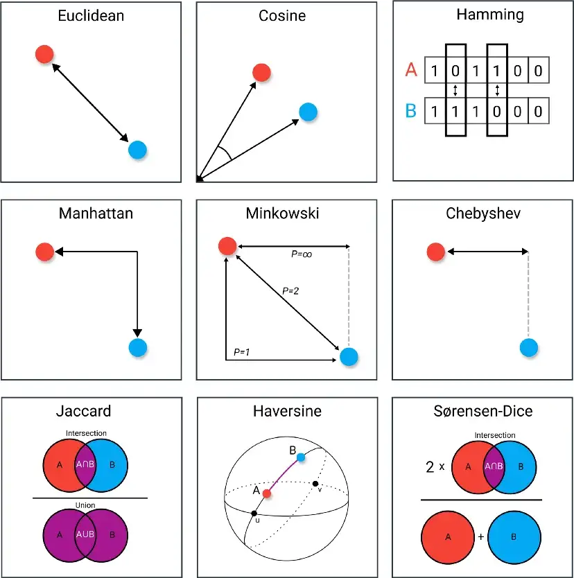
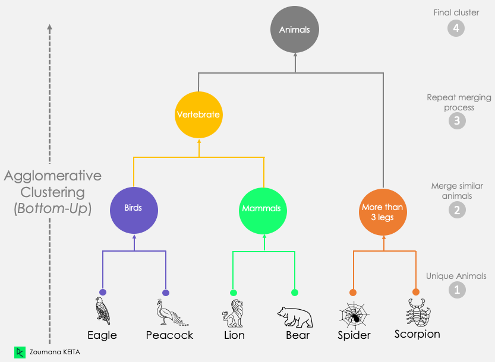
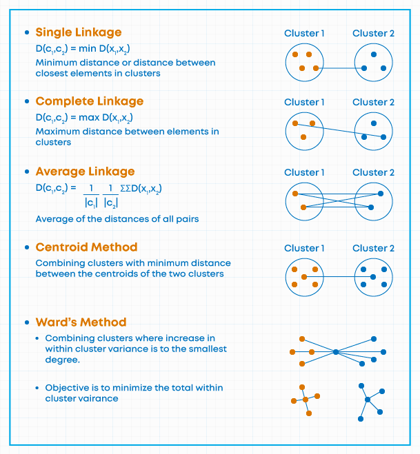
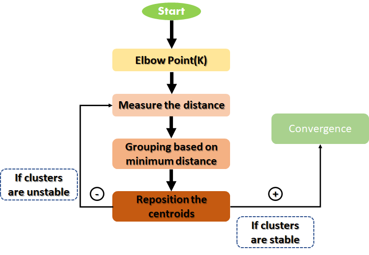

<!--
Define styles for the document
-->
<style>
    /* increase font size of the headers to double of the default size */
    h1 {
        font-size: 2.8em!important;
    }
    h2 {
        font-size: 2.5em!important;
    }
    h3 {
        font-size: 2.3em!important;
    }
    h4 {
        font-size: 2.0em!important;
    }
    h5 {
        font-size: 1.7em!important;
    }
    h6 {
        font-size: 1.5em!important;
    }
    .h7 {
        font-size: 1.3em!important;
        font-weight: bold!important;
        margin-bottom: 1em!important;
    }
    .h8 {
        font-size: 1.1em!important;
        font-weight: bold!important;
        margin-bottom: 1em!important;
    }

</style>

<h1> MDLE: Mineração de Dados em Larga Escala </h1>

<h2> Table of Contents </h2>

1. [Finding Similar Items – Locality-Sensitive Hashing](#finding-similar-items)
    1. [Keywords](#fsi-keywords)
    1. [Slide 3](#3)
    1. [Slide 4](#4)
    1. [Slide 12](#12)
    1. [Slide 14](#14)
    1. [Slide 16](#16)
    1. [Slide 17](#17)
    1. [Slide 26](#26)
    1. [Slide 27](#27)
    1. [Slide 37](#37)
    1. [Slide 43](#43)
    1. [Slide 49](#49)
1. [Locality-Sensitive Hashing](#lsh)
    1. [Keywords](#lsh-keywords)
    1. [Slide 12](#12a)
    1. [Slide 14](#14a)
    1. [Slide 17](#17a)
    1. [Slide 18](#18a)
    1. [Slide 23](#23a)
1. [Clustering](#clustering)
    1. [Keywords](#clustering-keywords)
    1. [Slide 2](#2b)
    1. [Slide 8](#8b)
    1. [Slide 9](#9b)
    1. [Slide 12](#12b)
    1. [Slide 13](#13b)
    1. [Slide 14](#14b)
    1. [Slide 18](#18b)
    1. [Slide 33](#33b)


<h2 id="finding-similar-items"> Finding Similar Items – Locality-Sensitive Hashing </h2

<h3 id="fsi-keywords"> Keywords </h3>

- Locality-Sensitive Hashing (LSH)

- High-dimensional data

- Jaccard similarity

- Shingling

- Min-Hashing

- Signature matrix

- Characteristic matrix

- Similar documents

- Near-duplicate detection

- Threshold tuning

- False positives/negatives

- Permutation of rows

- Hash functions

- Band and bucket

- Candidate pairs

<h3 id="3"> Slide 3 </h3>

It is not the same as finding exactly equal items. It is about finding items that are similar to each other. For example, sentences that are similar to each other, or images that are similar to each other. 

This is a very common problem in data mining and machine learning:
- In recommendation systems, we want to recommend items that are similar to the ones that the user has already seen or bought. In clustering, we want to group similar items together. 

- In classification, we want to classify an item based on the similarity with other items. 

- In anomaly detection, we want to detect items that are different from the rest. 

- In information retrieval, we want to retrieve items that are similar to the query. 

- In many other applications, we want to find similar items.

<h3 id="4"> Slide 4 </h3>

The naive approach to finding similar items is to compare each item with each other item. This is called the pairwise comparison.

The time complexity of this approach is $O(n^2)$, where n is the number of items. This is not feasible for large datasets.

The problem can be solved in $O(n)$ time using Locality-Sensitive Hashing (LSH). 

LSH is a technique that hashes similar items to the same bucket with high probability.

The idea is to hash items in such a way that similar items are likely to hash to the same bucket, while dissimilar items are likely to hash to different buckets.

This allows us to reduce the number of pairwise comparisons that need to be made, while still finding similar items with high probability $\rightarrow$ **It reduces the search space**.

<h3 id="12"> Slide 12 </h3>

Jaccard similarity is a measure of similarity between two sets. It maybe be uses in cases where the order of the elements does not matter.

If the order of the elements matters, we typically use the cosine similarity.

<h3 id="14"> Slide 14 </h3>

Shingles are large sets of items $\rightarrow$ much larger than the number of items in the dataset.

To solve this problem, we generate a small signature for each item, and then compare the signatures to find similar items.

The signatures should be generated in such a way that: **similarity of signatures $\approx$ similarity of sets**

**Why do we need to generate signatures?**
- To reduce the size of the data.

- To speed up the computation.

**Does it make the comparison worse? Would it be better to compare the shingles directly?**
- It does not make the comparison worse, because the signatures are generated in such a way that the similarity of the signatures is close to the similarity of the shingles.

- It is close but not exactly the same. However, it is good enough for many applications.

<h3 id="16"> Slide 16 </h3>

The hash function depends on the similarity metric: Not all similarity metrics have a suitable hash function.

For instance, a suitable hash function for Jaccard similarity is the Min-Hashing.

In Min-Hashing, we generate a signature matrix for each item, where each row is a hash function.

<h3 id="17"> Slide 17 </h3>

The characteristic matrix is a matrix where each row corresponds to a shingle, and each column corresponds to an item.

It is very large and sparse, so it is not feasible to store it in memory. This is where techniques like Min-Hashing come in.

<h3 id="26"> Slide 26 </h3>

The permutations represent the hash functions. The signature matrix is generated by permuting the rows of the characteristic matrix.

In the example, we have 4 items and 7 shingles. The characteristic matrix is a 7x4 matrix.

The number of hash functions is 3.

The signature matrix is a 3x4 matrix, where each row is a permutation of the rows of the characteristic matrix.

In this example the last row of the signature matrix becomes: $1, 2, 1, 2$.

Increasing the number of hash functions $\rightarrow$ Increases the size of the signature of each item $\rightarrow$ Increases the accuracy of the similarity estimation.

<h3 id="26"> Slide 26 </h3>

The jaccard similarity is the number of common elements between two sets divided by the number of distinct elements in the union of the two sets.

Characteristic matrix has rows of types a, b, c, d:

- **a**: The items $X$ and $Y$ have the shingle.
- **b**: The item $X$ has the shingle, but the item $Y$ does not.
- **c**: The item $Y$ has the shingle, but the item $X$ does not.
- **d**: Neither item $X$ nor item $Y$ has the shingle.

Looking at the sets this way, the similarity between two items can be calculated as:

$$ J(A, B) = a / (a + b + c) $$

Items of type $a$ represent the intersection of the two sets, and items of types $a$, $b$, and $c$ represent the union of the two sets. The $d$ items are not considered in the similarity calculation.

Generally, the Jaccard similarity is defined as:

$$ J(A, B) = \frac{|A \cap B|}{|A \cup B|} $$

There are many other similarity metrics that can be used, depending on the application. The following image shows multiple distance functions that can be used to measure the similarity between two items:

<p align="center">
    

<h3 id="27"> Slide 27 </h3>

Permuting rows is **prohibitive!** It is not feasible to generate all possible permutations of the rows of the characteristic matrix.

That is why in Min-Hashing we use a trick to generate the hash functions: We use a family of hash functions that are pairwise independent.

For a family of **pairwise independent hash functions** $\mathcal{H}$, the probability that a hash function $h$ from $\mathcal{H}$ maps two distinct elements $i$ and $j$ to the same value, i.e., $\Pr[h(i) = h(j)]$, is given by:

$$
\Pr[h(i) = h(j)] = \frac{1}{|\text{range of } h|}
$$

- range of $h$ is the number of possible values that the hash function $h$ can take.

This probability is not related to the Jaccard similarity between sets containing $i$ and $j$.

However, for a family of **minwise hash functions** used in the context of sets $A$ and $B$, the probability that the hash function $h$ maps the minimum element of set $A$ and the minimum element of set $B$ to the same value is equal to the Jaccard similarity $J(A, B)$. Specifically:

$$
\Pr[h(\min(A)) = h(\min(B))] = J(A, B) = \frac{|A \cap B|}{|A \cup B|}
$$

<h3 id="37"> Slide 37 </h3>

Min-Hashing can be speed up by dividing the signature matrix into bands and buckets.

The idea is to hash the rows of the signature matrix into bands, and then hash the bands into buckets.

- If two items hash to the same bucket in at least one band, they are considered candidate pairs.

- Divide the rows into $k / r$ bands, where $k$ is the number of hash functions and $r$ is the number of rows in each band.

- $k = r \times b$, where $b$ is the number of bands.

These parameters $r$ and $b$ are chosen in such a way that the probability of two similar items hashing to the same bucket is maximized, while the probability of two dissimilar items hashing to the same bucket is minimized.

<h3 id="43"> Slide 43 </h3>

**Error rate**

With LSH, it is possible to estimate the probability that two signatures with similarity $s$ will be considered as candidates given a number of bands $b$ and number of rows $r$ in each band. Let us find the formula for it in several steps.

The probability that one random row of both signatures is equal:
$$ P = s $$

The probability that one random band with $r$ rows is equal:
$$ P = s^r $$

The probability that one random band with $r$ rows is different:
$$ P = 1 - s^r $$

The probability that all $b$ bands in the table are different:
$$ P = (1 - s^r)^b $$

The probability that at least one of $b$ bands is equal, so two signatures are candidates:
$$ P = 1 - (1 - s^r)^b $$

Note that the formula does not take into consideration collisions when different subvectors accidentally hash into the same bucket. Because of this, the real probability of signatures being the candidates might insignificantly differ.

Suppose we want to calculate a combination of $b$ and $r$ that finds at least **90% of the pairs with 85% similarity** and **less than 5% of the pairs with 60% similarity** as candidates.

```python
# Similarity thresholds
s1 = 0.85
s2 = 0.60

# Desired probabilities
p1 = 0.90
p2 = 0.05

# Finding the combination of b and r
for r in range(1, 100):
    for b in range(1, 100): 
        # Here, we calculate the probability that two signatures with similarity s will be considered as candidates
        p_cand_85 = 1 - (1 - s1**r)**b
        p_cand_60 = 1 - (1 - s2**r)**b
        if p_cand_85 >= p1 and p_cand_60 <= p2:
            print(f"b = {b}, r = {r}, p_cand_85 = {p_cand_85:.4f}, p_cand_60 = {p_cand_60:.4f}")
```

<h3 id="49"> Slide 49 </h3>

The formula for threshold tuning in Locality Sensitive Hashing (LSH), given by:

$$ t \approx ( \frac{1}{b} )^{\frac{1}{r}} $$

provides an approximate threshold $t$ where pairs of items with a similarity above $t$ are likely to be considered as candidates for further comparison. To understand where this formula comes from, we need to delve into the probabilistic foundations of LSH and how it relates to similarity detection.

1. **Probability of Being a Candidate**:
    - If two items have a similarity $s$, the probability that they hash to the same bucket in one band is $s^r$.

    - The probability that they do not hash to the same bucket in any band is $(1 - s^r)^b$.

    - Thus, the probability that they hash to the same bucket in at least one band is: $1 - (1 - s^r)^b$.

2. **Threshold Calculation**:
    - The threshold $t$ is the similarity level at which the probability of being considered as a candidate is approximately 0.5.

    - Setting the probability of being a candidate to 0.5, we have: $1 - (1 - t^r)^b = 0.5 \implies (1 - t^r)^b = 0.5$.

3. **Solving for Threshold**:
    - Taking the natural logarithm on both sides: $ln((1 - t^r)^b) = \ln(0.5) \implies b \ln(1 - t^r) = \ln(0.5)$.

    - Using the approximation $\ln(1 - x) \approx -x$ for small $x$: $-b t^r \approx \ln(0.5) \implies t^r \approx -\frac{\ln(0.5)}{b} \implies t^r \approx \frac{ln(2)}{b} $.

    - Solving for $t$: $t \approx ( \frac{1}{b} )^{\frac{1}{r}}$.

4. **Simplied Formula**:
    - Since $\ln(2)$ is a constant (approximately 0.693), for practical purposes, the formula is often simplified to: $t \approx ( \frac{1}{b} )^{\frac{1}{r}}$.

<h2 id="lsh"> Locality-Sensitive Hashing </h2>

<h3 id="lsh-keywords"> Keywords </h3>

- Locality-Sensitive Hashing (LSH)

- Similar Documents

- Min-Hashing

- Signature Matrices

- Hash Functions

- Jaccard Distance

- Cosine Distance

- Euclidean Distance

- Random Hyperplanes

- Random Projections

- AND-OR Constructions

<h3 id="12a"> Slide 12 </h3>

A family H of hash functions is said to be $(d_1, d_2, p_1, p_2)$-sensitive if for any two points $p$ and $q$:

1. If $d(p, q) \leq d_1$, then the probability that $h(p) = h(q)$ is at least $p_1$.

2. If $d(p, q) \geq d_2$, then the probability that $h(p) = h(q)$ is at most $p_2$.

The goal is to design a family of hash functions that is sensitive to the distance between points.

For Jaccard distance, Min-Hashing (next slide) gives a:
$(d_1, d_2, (1 - d_1), (1 - d_2))$-sensitive family of hash functions.

<h3 id="14a"> Slide 14 </h3>

$d(x, y) = 1 - J(x, y)$ is a distance metric that is sensitive to the Jaccard similarity between two sets.

Since:
$$P[h(p) = h(q)] = J(p, q) = \frac{|p \cap q|}{|p \cup q|}$$

and:
$$d(p, q) = 1 - J(p, q)$$

we can say that:
$$P[h(p) = h(q)] = 1 - d(p, q)$$

<h3 id="17a"> Slide 17 </h3>

**AND of Hash Functions**:

- Given a family of hash functions $H$, construct a new family $H'$ consitsting of $r$ hash functions, where:
$$h'(x) = (h_1(x), h_2(x), ..., h_r(x))$$

- The probability that $h'(x) = h'(y)$ is equal to the probability that $h_1(x) = h_1(y) \land h_2(x) = h_2(y) \land ... \land h_r(x) = h_r(y)$.

- This means that $x$ and $y$ will hash to the same bucket if and only if they hash to the same bucket in **all** hash functions (within the same band).

- If $h_1, h_2, ..., h_r$ are independent hash functions, then:
$$P[h'(x) = h'(y)] = P[h_1(x) = h_1(y)] \times P[h_2(x) = h_2(y)] \times ... \times P[h_r(x) = h_r(y)]$$

- **Lowers probability for large distances (Good)**: Decreases the probability that dissimilar items hash to the same bucket.

- **Lowers probability for small distances (Bad)**: Decreases the probability that similar items hash to the same bucket.

<h3 id="18a"> Slide 18 </h3>

**OR of Hash Functions**:

- Given a family of hash functions $H$, construct a new family $H'$ consitsting of $b$ hash functions, where:

$$h'(x) = h_1(x) \lor h_2(x) \lor ... \lor h_b(x)$$

- The probability that $h'(x) = h'(y)$ is equal to the probability that $h_1(x) = h_1(y) \lor h_2(x) = h_2(y) \lor ... \lor h_b(x) = h_b(y)$.

- This means that $x$ and $y$ will hash to the same bucket if they hash to the same bucket in **at least one** hash function (or band).

- If $h_1, h_2, ..., h_b$ are independent hash functions, then:

$$P[h'(x) = h'(y)] = 1 - (1 - P[h_1(x) = h_1(y)]) \times (1 - P[h_2(x) = h_2(y)]) \times ... \times (1 - P[h_b(x) = h_b(y)])$$

- **Increases probability for large distances (Good)**: Increases the probability that dissimilar items hash to the same bucket.

- **Increases probability for small distances (Bad)**: Increases the probability that similar items hash to the same bucket.

<h3 id="23a"> Slide 23 </h3>

We can use a chain of AND-OR or OR-AND constructions to balance the probabilities for different distances.

For instance, if we have $256$ hash functions, we can divide them into $(4, 4) OR-AND$ constructions, and $(4, 4) AND-OR$ constructions.

This way, we can increase the probability that similar items hash to the same bucket, while decreasing the probability that dissimilar items hash to the same bucket.

<h2 id="clustering"> Clustering </h2>

<h3 id="clustering-keywords"> Keywords </h3>

- Clustering

- Large Scale Datasets

- Agglomerative Hierarchical Clustering

- Centroid

- Cluster Distance

- Cohesion

- K-means

- Initialization

- BFR

- CURE

- Selecting K

- Average Distance to Centroid

- Music CDs

- Categories

- Genres

- Customers

- Space Representation

- Dimensions

- Amazon

- Similar CDs

- Documents

- Topics

- Vectors

- Words

- Topic Similarity

<h3 id="2b"> Slide 2 </h3>

Usually points are in a high-dimensional space. This means that each point is represented by a vector with many dimensions.

For instance, in the case of music CDs, each CD can be represented by a vector with dimensions corresponding to the categories or genres of the music.

In the case of customers, each customer can be represented by a vector with dimensions corresponding to the products they have bought.

Similarity between points is calculated based on the distance between the vectors. That could be the Euclidean distance, the cosine distance, or any other distance metric.

<h3 id="8b"> Slide 8 </h3>

There are 2 types of Hierarchical Clustering:
- **Agglomerative (bottom-up)**: Start with each point as a cluster, and then merge the closest clusters until there is only one cluster left.

- **Divisive (top-down)**: Start with all points in one cluster, and then split the cluster into smaller clusters until each point is in its own cluster.

In the following image, we can see an example of Agglomerative Hierarchical Clustering:

<p align="center">
    
</p

The point assignment is typically done in 3 steps:
1. **Select the number of clusters**: This can be done based on the data or based on the application.
2. **Initialize the clusters**: This can be done randomly or based on some heuristic.
3. **Iteratively assign points to the "nearest" clusters**: This can be done based on the distance between the points and the clusters.

<h3 id="9b"> Slide 9 </h3>

1) **How do you represent a cluster of more than one point?**

    It depends on the distance metric. For instance, in the case of the Euclidean distance, a cluster can be represented by its **centroid**.

2) **How do you determine the "nearness" of clusters?**

    The nearness of clusters can be determined based on the distance between the centroids of the clusters.
    There are different ways to calculate the distance between clusters, such as the **single-linkage**, **complete-linkage**, **average-linkage**, and **centroid-linkage**.

    The following image shows the different linkage methods:

    <p align="center">
        
    </p

3) **When to stop combining clusters?**

    The stopping criterion can be based on the number of clusters, the distance between clusters, or the cohesion of the clusters.

    The "cohesion" of a cluster is a measure of how close the points in the cluster are to each other. It can be calculated as the average distance between the points in the cluster and the centroid of the cluster.

    When cohesion is high, the points in the cluster are close to each other, and when cohesion is low, the points in the cluster are far from each other.
    We can early stop the clustering process if the cohesion of the clusters drops below a certain threshold.

<h3 id="12b"> Slide 12 </h3>

Clustroid is the point "closest" to the other points in the cluster.

The "closeness" can be defined in different ways, as we have seen before with the different linkage methods.

The most common way to define the closeness is to use the average distance between the points in the cluster and the clustroid. This is called the **average-linkage**.

1) **In the case of **average-linkage**, the clustroid is the same as the point closest to centroid?**

    No, the clustroid is the point closest to the other points in the cluster, while the centroid is the point closest to all the points in the cluster.

    Consider a cluster of points that are not symmetrically distributed. The centroid might be located at a geometric center that does not correspond to any actual data point. The clustroid, however, will be a data point and may be closer to the dense region of the cluster rather than the geometric center.

**Centroid**:
- Computed as the mean of all points in the cluster.

- Not necessarily a member of the dataset ("artificial" point).

- Sensitive to outliers since it considers all points equally.

**Clustroid**:
- Defined as the point that minimizes the sum of distances to all other points in the cluster.

- Always a member of the dataset.

- It is also called the **medoid** (like median of the cluster).

- Less sensitive to outliers, especially in large datasets, since it minimizes the - sum of distances and not the positional average.

<h3 id="13b"> Slide 13 </h3>

In the case on **non-Euclidean spaces**, the only "locations" that make sense are the data points themselves (there is no "average" of two points in a non-Euclidean space).

1) **What is a non-Euclidean space?**

    A non-Euclidean space refers to a geometric space where the axioms and rules of classical Euclidean geometry do not apply, particularly those concerning the nature of parallel lines and the sum of angles in a triangle. Non-Euclidean spaces can exhibit different properties and structures compared to the familiar Euclidean space.

2) **How do you calculate the centroid in a non-Euclidean space?**

    In a non-Euclidean space, the concept of a centroid as the average of points does not apply. Instead, one can use the concept of a clustroid or medoid, which is the point in the cluster that minimizes the sum of distances to all other points in the cluster. This point is a member of the dataset and is less sensitive to outliers compared to the centroid.

3) **How to represent a cluster of many points?**

    Use clustroid: the point that minimizes the sum of distances to all other points in the cluster.

4) **How to determine "nearness" of clusters?**

    - **Approach 1**: Treat clustroid as if it were centroid, when computing intercluster distances

    - **Approach 2**:  No centroid, take intercluster distance as either:
        - **Single-linkage**: Minimum distance between points in different clusters.
        - **Complete-linkage**: Maximum distance between points in different clusters.
        - **Average-linkage**: Average distance between points in different clusters.
        - **Centroid-linkage**: Distance between centroids of clusters.

5) **When to stop combining clusters?**

    - Stop at some predefined number of clusters

    - Stop if next merge creates a cluster with low cohesion:

        - **Radius/diameter of resulting cluster is above some threshold**:

            - **Radius**: Maximum distance between all the points in the cluster and the clustroid.

            - **Diameter**: Maximum distance between any two points in the cluster.

        - **Density of the cluster is below some threshold**:

            - **Density**: Number of points in the cluster per unit volume.
                - The unit can be square units in 2D or cubic units in 3D, etc.

<h3 id="14b"> Slide 14 </h3>

$K$-means is a popular clustering algorithm that partitions the data into $K$ clusters.

The following image shows an example of $K$-means clustering:

<p align="center">
    
</p>

The elbow method is a common technique to select the number of clusters $K$.

We want the number of clusters to be the smallest possible while still capturing the structure of the data.

- If the number of clusters is too small, the clusters will be too large and will not capture the structure of the data.

- If the number of clusters is too large, the clusters will be too small and will not capture the structure of the data.

- Same problem for both cases: **Underfitting** and **Overfitting**.

<h3 id="18b"> Slide 18 </h3>

The **BFR (Bradley-Fayyad-Reina) algorithm** is a variation of the $k$-means clustering algorithm designed to handle **large-scale data**, particularly suited for distributed systems. Below is a pseudo-code representation of the BFR algorithm, including steps before and after the main iterative process. The pseudo-code covers the initialization, the iterative clustering process, and final cluster formation.

The **BFR algorithm** is designed to efficiently cluster very large datasets that cannot be loaded into memory all at once. It uses a combination of memory-efficient **statistical summaries** and disk-based processing.

The algorithms includes 3 different sets to keep track of the points:

- **DS (Dense Set)**: Points close enough to a centroid to be summarized.

- **CS (Compressible Set)**: Groups of points that are close together but not close to any existing centroid. These points are summarized, but not assigned to a cluster.

- **RS (Random Set)**: Isolated points waiting to be assigned to a compression set.

**Summarization** is done by keeping track of the **mean**, **variance**, and **number of points** in each cluster. This allows the algorithm to efficiently update the centroids and assign points to clusters.

The algorithm consists of the following steps:

- **Initialization**: The algorithm starts by initializing $K$ centroids using one of the methods mentioned.

- **Set Initialization**: Three sets (DS, CS, RS) are initialized to keep track of clustered, compressible, and outlying points.

- **Loading Points**: Points are loaded in chunks due to memory constraints.

- **Point Assignment**: Points are assigned to existing clusters if they are close enough; otherwise, they are temporarily added to RS.

- **Clustering Remaining Points**: Remaining points and previous RS points are clustered, and new clusters are either added to CS or kept in RS.

- **Merging Clusters**: CS clusters are merged with DS clusters if they are close enough. If it's the last iteration, all remaining points and clusters are merged into the nearest DS clusters.

**Note**: The BFR algorithm assumes that the data follows a normal distribution and that the clusters are spherical. It is designed to handle large datasets efficiently and is particularly useful in distributed systems.

1) **How do we decide if a point is “close enough” to a cluster?**

    The decision of whether a point is "close enough" to a cluster is typically based on a the Mahalanobis distance, which takes into account the variance and covariance of the cluster. The Mahalanobis distance is a measure of the distance between a point and a distribution, taking into account the variability of the data.

    The Mahalanobis distance is defined as:
    $$ D_M(x, \mu, \Sigma) = \sqrt{(x - \mu)^T \Sigma^{-1} (x - \mu)} $$

    Where:

    - $x$ is the point.
    - $\mu$ is the mean of the cluster.
    - $\Sigma$ is the covariance matrix of the cluster.

    It can also be calculated as:

    $$ D_M(x, c) = \sqrt{\frac{\sum_{i=1}^{d} (x_i - c_i)^2}{\sum_{i=1}^{d} \sigma_i^2}} $$

    The normalized distance in dimension $i$ is given by:
    $$ \frac{(x_i - c_i)^2}{\sigma_i^2} $$

    - $x_i$ is the $i$-th coordinate of the point $x$.
    - $c_i$ is the $i$-th coordinate of the centroid $c$.
    - $\sigma_i$ is the standard deviation of the $i$-th coordinate.

2) **Should two CS subclusters be combined?**

    Compute the variance of the combined subcluster:
        - N, SUM, and SUMSQ allow quick calculation.

    We can combine if the variance of the combined subcluster is below a certain threshold.

    Or if the density of the combined subcluster does not drop below a certain threshold.

<h3 id="33b"> Slide 33 </h3>

The **CURE (Clustering Using Representatives) algorithm** is a clustering algorithm that is designed to handle large datasets and is particularly useful for clustering in high-dimensional spaces. The algorithm is based on the idea of using a set of representative points to summarize the data and perform clustering.
