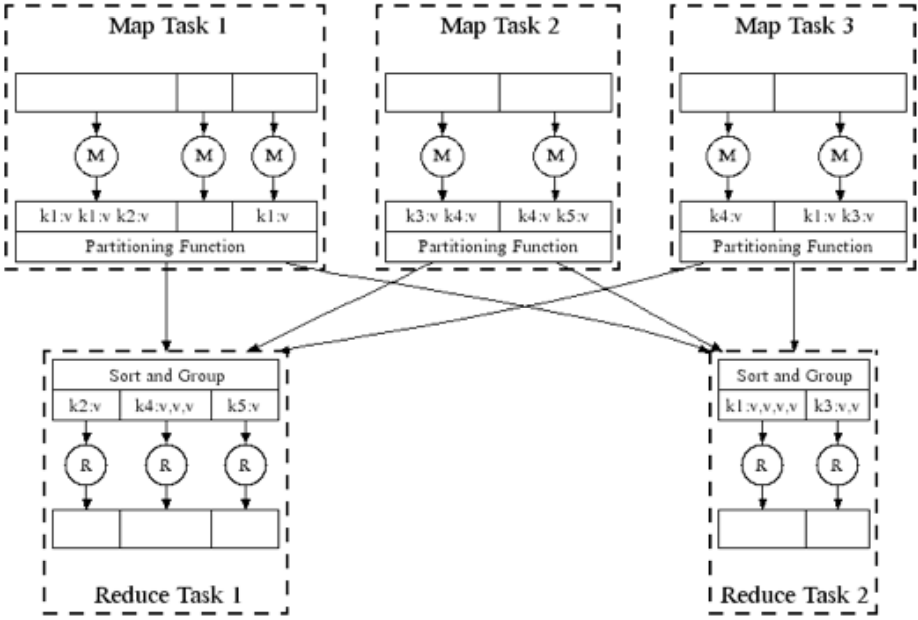

<!--
Define styles for the document
-->
<style>
    /* increase font size of the headers to double of the default size */
    h1 {
        font-size: 2.8em!important;
    }
    h2 {
        font-size: 2.5em!important;
    }
    h3 {
        font-size: 2.3em!important;
    }
    h4 {
        font-size: 2.0em!important;
    }
    h5 {
        font-size: 1.7em!important;
    }
    h6 {
        font-size: 1.5em!important;
    }
    .h7 {
        font-size: 1.3em!important;
        font-weight: bold!important;
        margin-bottom: 1em!important;
    }
    .h8 {
        font-size: 1.1em!important;
        font-weight: bold!important;
        margin-bottom: 1em!important;
    }

</style>

<h1> MDLE: Mineração de Dados em Larga Escala </h1>

<h2> Table of Contents </h2>

1. [Course Overview](#course-overview)
    1. [Data Mining Fundamentals](#data-mining-fundamentals)
    1. [Descriptive vs. Predictive Methods](#descriptive-vs-predictive-methods)
    1. [Course Objectives](#course-objectives)
    1. [Practical Applications](#practical-applications)
1. [Distributed File Systems and MapReduce](#distributed-file-systems-and-mapreduce)
    1. [Motivation](#motivation)
        1. [Types of Data](#types-of-data)
        1. [Computation Models](#computation-models)
        1. [Massive Data Challenges](#massive-data-challenges)
        1. [Classical Approach](#classical-approach)
        1. [Cluster Computing](#cluster-computing)
            1. [Challenges](#challenges)
            1. [Network Bottleneck](#network-bottleneck)
            1. [Storage Infrastructure](#storage-infrastructure)
    1. [Distributed File Systems](#dfs)
        1. [Components](#components)
        1. [Advantages of Distributed File Systems](#advantages-of-distributed-file-systems)
    1. [Programming Model](#programming-model)
        1. [MapReduce Implementations](#mapreduce-implementations)
        1. [Operational Workflow](#operational-workflow)
        1. [MapReduce Environment](#mapreduce-environment)
        1. [MapReduce Example](#mapreduce-example)
        1. [Data Flow](#data-flow)
        1. [Master Node](#master)
        1. [Handling Failures](#handling-failures)
        1. [Number of Map and Reduce Jobs](#num-mappers-reducers)
        1. [Refinements: Combiners](#refinements-combiners)
        1. [Problems with MapReduce](#problems)
        1. [Advantages of MapReduce](#advantages-of-mapreduce)
    1. [Data Flow Systems](#data-flow-systems)
        1. [Apache Spark](#spark)
            1. [Additions to MapReduce Model](#additions-to-the-mapreduce-model)
            1. [Architecture](#spark-architecture)
            1. [Resilient Distributed Datasets (RDDs)](#spark-rdd)
                1. [Operation Types](#spark-operation-types)
                1. [Transformations](#spark-rdd-transformations)
                1. [Actions](#spark-rdd-actions)
                1. [Example](#spark-rdd-example)
                1. [Task Scheduler](#spark-task-scheduler)
            1. [Higher-Level APIs](#spark-higher-level-apis)
            1. [Libraries and Ecosystem](#spark-libraries)
            1. [Spark vs. Hadoop MapReduce](#spark-vs-mapreduce)
1. [Frequent Itemsets and Association Rules](#frequent-itemsets-and-association-rules)
    1. [Motivation](#frequent-itemsets-and-association-rules-motivation)
    1. [Market Basket Model](#market-basket-analysis)
        1. [Item-Basket Relationships](#mba-relationship)
        1. [Applications](#mba-applications)
        1. [Frequent Itemsets](#frequent-itemsets)
        1. [Association Rules](#association-rules)
            1. [Support](#support)
            1. [Confidence](#confidence)
            1. [Interest](#interest)
            1. [Lift](#lift)
            1. [Standardized Lift](#standardized-lift)
        1. [Algorithms for finding frequent itemsets](#algorithms-for-finding-frequent-itemsets)
            1. [Mining Association Rules](#mining-assoc-rules)
                1. [Example](#mining-assoc-rules-example)
                1. [Compact Output](#mining-assoc-rules-compact-output)
            1. [Finding frequent itemsets](#finding-frequent-itemsets)
                1. [Finding Frequent Pairs](#find-frequent-pairs)
                    1. [Triangular matrix](#counting-all-pairs-using-a-triangular-matrix)
                    1. [Table of triples](#keeping-a-table-of-triples)
                1. [Monotonicity of Itemsets](#monotonicity-of-itemsets)
                1. [A-Priori Algorithm](#a-priori-algorithm)
                    1. [Operational Workflow (2 passes)](#a-priori-operational-workflow)
                        1. [Memory Usage](#a-priori-memory-usage)
                    1. [Operational Workflow (more than 2 passes)](#a-priori-operational-workflow)
                        1. [Example](#a-priori-example)
                1. [PCY Algorithm](#pcy-algorithm)
                    1. [Pass 1](#pcy-pass-1)
                    1. [Pass 2](#pcy-pass-2)
                    1. [Memory Usage](#pcy-memory-usage)
                    1. [Buckets](#pcy-buckets)
                    1. [Multistage PCY](#pcy-multistage)
                        1. [Conditions for Candidate Pairs](#pcy-multistage-condition)
                        1. [Operational Workflow](#pcy-multistage-operation)
                        1. [Multihash](#pcy-multihash)
                1. [Frequent Itemsets (Less Than 2 Passes)](#frequent-itemsets-lt-2-passes)
                    1. [Random Sampling](#random-sampling)
                    1. [SON Algorithm](#son-algorithm) 
                        1. [Steps](#son-algorithm-steps)  
                        1. [MapReduce Implementation](#son-algorithm-mapreduce)
                        1. [Key Points](#son-algorithm-key-points)
                    1. [Toivonen Algorithm](#toivonen-algorithm)
                        1. [Steps](#toivonen-algorithm-steps)
                        1. [Theorem and Implications](#toivonen-algorithm-theorem)
            1. [Summary](#frequent-itemsets-and-association-rules-summary)
                1. [Frequent Itemsets (2 Full Passes)](#frequent-itemsets-and-association-rules-summary-2-full-passes)
                1. [Frequent Itemsets (Less Than 2 Passes)](#frequent-itemsets-and-association-rules-summary-less-2-passes)

<h2 id="course-overview"> Course Overview </h2>

<h3 id="data-mining-fundamentals"> Data Mining Fundamentals </h3>

Understanding that data mining involves **extracting actionable knowledge** from large datasets, which includes discovering patterns and models that are:
- **Valid**:  accurate and reliable.

- **Useful**:  can be acted upon.

- **Unexpected**:   non-obvious to the system.

- **Understandable**:  can be interpreted by humans.

<h3 id="descriptive-vs-predictive-methods"> Descriptive vs. Predictive Methods </h3>
Learning about descriptive methods like clustering to find patterns, and predictive methods such as recommender systems to predict future values.

<h3 id="course-objectives"> Course Objectives </h3>

To extract knowledge, data needs to be:
- **Stored**:  in a database or data warehouse.

- **Managed**:  to ensure data quality and consistency.

- **Analyzed**:  to discover patterns and models $\leftarrow$ this is the focus of the course.

The course focuses on the analysis part, which an emphasis on scalability and algorithms for handling big data, including parallelization and computing architectures.

We do not deal (much) with storage and management, and other topics like data ethics, privacy, and security (which are also important).

<h3 id="practical-applications"> Practical Applications </h3>

Applying various tools and techniques like linear algebra, optimization, dynamic programming, and hashing to solve real-world problems such as spam detection and market basket analysis.

<h2 id="distributed-file-systems-and-mapreduce"> Distributed File Systems and MapReduce </h2>

<h3 id="motivation"> Motivation </h3>

<h4 id="types-of-data"> Types of Data </h4>

- **High-Dimensional Data**: Data with many features (dimensions).

- **Graphs**: Represent relationships between entities (nodes and edges).

- **Streams**: Continuous data arriving in real-time.

- **Labeled Data**: Data with predefined categories (e.g., spam vs. not spam).

<h4 id="computation-models"> Computation Models </h4>

- **MapReduce**: Simplifies distributed programming by breaking tasks into map and reduce functions.

- **Streams & Online Algorithms**: Handle continuous data streams efficiently.

- **Single Machine In-Memory Processing**: Process data that fits in memory.

<h4 id="massive-data-challenges"> Massive Data Challenges </h4>

**Data Transfer (Bandwidth) Limitations**: Reading large datasets from storage (e.g., SSDs, HDDs) is time-consuming. It can take 1 hour to read 1TB from an SSD (10x more from an HDD), and we still haven’t done anything with the data.

**Memory Limitations**: Storing large datasets in memory is not feasible. For example, a 1TB dataset requires 1TB of memory, which is expensive and not scalable.

<h4 id="classical-approach"> Classical Approach </h4>

The **classical approach** to machine learning and data mining involves reading the entire dataset into memory, processing it, and writing the results back to disk.

<p align="center">
    
</p>

There are **three main strategies for handling large datasets**:
- **Entire data processed in memory**: Data is read from disk to memory, processed, and results are written back to disk.

- **Partial data read to memory**: Data is read in chunks, processed, and results are written back to disk.

- **Partial results written to disk**: Intermediate results are written to disk, read back, and processed further.

This approach is **not scalable** for large datasets due to memory limitations and slow disk I/O. It is also **not fault-tolerant**, as a failure during processing can result in data loss.

**What if data so big that the computation takes too long?**
- **Split data**: Divide data into smaller chunks.

- **Use multiple processors**: Process data in parallel.

- **Use multiple machines**: Distribute computation across a cluster.

The **solution** is to use **distributed computing** or **cluster computing** to process large datasets efficiently.

<h4 id="cluster-computing"> Cluster Computing </h4>

**Cluster computing** involves connecting multiple machines (nodes) to work together on a task. It is used to process large datasets that cannot fit on a single machine. 

<p align="center">
    
</p>

**Compute nodes are commodity hardware**: cheap (low cost compared to special-purpose parallel machines) and easily replaceable. They are connected by a network, and a master node coordinates the processing tasks. 

**Cluster computing** can be defined as <cite>"large-scale computing for data mining problems on commodity hardware"</cite>.

<h5 id="challenges"> Challenges </h5>

- **How to distribute computation across multiple machines?**: Distributing computation across multiple machines involves a nuanced understanding of how to split tasks efficiently, ensuring that each machine performs its work without redundant effort and that the system scales well as the number of machines increases. Key considerations include:
    - **Data Partitioning**: Data must be partitioned and distributed among machines to avoid bottlenecks and ensure balanced workloads. Strategies like hashing, range-based partitioning, or consistent hashing are commonly used to distribute data across nodes.

    - **Parallelism**: Effective parallelism requires dividing tasks in a way that they can be executed concurrently without causing inter-process dependencies that could lead to delays.

    - **Network Latency and Bandwidth**: Communication overhead between machines should be minimized, as excessive data transfer can negate the benefits of parallel processing. Techniques such as data locality (placing computation near the data) and efficient serialization/deserialization mechanisms are crucial.

    - **Load Balancing**: Ensuring that no single machine becomes a bottleneck by evenly distributing the computational load across all available machines is vital for maintaining performance.

- **How to make it easy to write distributed programs?**: Writing distributed programs is inherently complex due to the need to manage various aspects such as concurrency, data consistency, and failure handling. To ease this complexity, several abstractions and tools are used:
    - **Distributed Frameworks and Libraries**: Frameworks like Apache Hadoop, Apache Spark, and Google’s MapReduce provide abstractions that simplify the implementation of distributed algorithms by handling low-level details like task distribution, fault tolerance, and data shuffling.

    - **Functional Programming Paradigms**: Many distributed systems use functional programming principles that facilitate immutability and stateless computations, making it easier to distribute tasks across machines without worrying about shared state.

    - **Declarative APIs**: High-level APIs allow developers to describe what they want to compute rather than how to compute it. Examples include SQL-like query languages in distributed databases and big data processing frameworks.

    - **Workflow Orchestration Tools**: Tools like Apache Airflow or Kubernetes help in managing complex task dependencies, scheduling, and resource allocation, simplifying the overall development and deployment process.

- **How to handle machine failures gracefully?**: In large-scale distributed systems, machine failures are not an exception but a norm. Systems must be designed to handle these failures gracefully to ensure continued operation. Considerations include:
    - **Redundancy and Replication**: Critical data should be replicated across multiple machines to ensure that a failure of one machine does not result in data loss. Replication strategies like master-slave or quorum-based replication can help maintain data availability and consistency.

    - **Checkpointing and State Management**: Long-running tasks should periodically save their state (checkpointing) so that they can resume from the last known state in case of a failure, rather than starting from scratch. Systems like Spark use lineage graphs to recompute lost data efficiently.

    - **Fault Detection and Recovery**: Automated monitoring systems can detect failures and trigger recovery mechanisms. For instance, in Hadoop, a JobTracker can reassign failed tasks to other nodes, ensuring that the overall job continues to progress.

    - **Statistical Failure Handling**: Given that large clusters experience frequent failures (e.g., with 1,000 servers, one might expect at least one failure per day), systems must be designed to tolerate these failures and continue operating effectively. This involves mechanisms like distributed consensus algorithms (e.g., Paxos, Raft) for ensuring agreement among nodes in the presence of failures.

<h6 id="network-bottleneck"> Network Bottleneck </h6>

Copying data over a network takes time and can be a bottleneck in distributed systems. To minimize network traffic, we can:
- **Bring computation to data**: Move computation to the data rather than moving data to the computation. This is known as data locality and is a key principle in distributed computing.

- **Store files multiple times for reliability**: Replicate files across multiple nodes to ensure that data is available even if some nodes fail. This also helps with data locality, as the computation can be performed on the node that has a copy of the data.

**Spark** and **Hadoop** are two popular frameworks that address these challenges by providing abstractions for distributed computing and fault tolerance.
- Storage Infrastructure: Distributed File system
    - **Google File System (GFS)**: A distributed file system that provides fault tolerance and high throughput access to data. It is designed to store large files across multiple machines and handle failures gracefully.

    - **Hadoop Distributed File System (HDFS)**: A distributed file system that stores data across multiple machines in a fault-tolerant manner. It is designed to handle large datasets and provides high throughput access to data.

- Programming Model
    - **MapReduce**: A programming model introduced by Google for processing large datasets in parallel across a cluster of machines. It simplifies distributed programming by breaking tasks into map and reduce functions.

    - **Apache Spark**: A fast and general-purpose cluster computing system that provides in-memory processing for large-scale data processing. It offers a more flexible programming model than **MapReduce** and is known for its speed and ease of use.

<h6 id="storage-infrastructure"> Storage infrastructure </h6>

If nodes fail, data can be lost. To prevent data loss, we can replicate data across multiple nodes. This ensures that even if some nodes fail, the data is still available.

The solution to these challenges are **Distributed File Systems (DFS)**. A DFS is a file system that manages data across multiple machines, providing a **global file namespace** and ensuring data **availability** and **reliability**. Two popular DFSs are: **Google File System (GFS)** and **Hadoop Distributed File System (HDFS)**, mentioned earlier.

The typical usage pattern for a DFS is to store files that are:
- **Too large for a single machine**: Files often range from hundreds of gigabytes to terabytes, making it impractical to store them on a single machine.

- **Rarely updated in place**: Files are typically written once and then accessed frequently for reading, with minimal modifications to existing content.

- **Frequently read and appended to**: Data is frequently added to the file in an append-only manner, with subsequent reads and extensions being the typical operations.

<h3 id="dfs"> Distributed File Systems </h3>

- **Data kept in "chunks" spread across machines**: Files are divided into fixed-size chunks (e.g., 64MB) and distributed across multiple machines in the cluster.

- **Each chunk replicated on different machines**: Each chunk is replicated on multiple machines (typically three) to ensure fault tolerance. If one machine fails, the data can still be accessed from another replica $\rightarrow$ Seamless recovery from disk or machine failure.

<p align="center">
    
</p>

In a DFS, data is split into chunks that are stored across multiple servers, known as **chunk servers**. Each **chunk server** stores a subset of the total data, enabling parallel data access and redundancy.

Traditionally, data stored in a DFS would be processed by separate compute servers, which retrieve data over the network. This separation can lead to inefficiencies due to network latency and bandwidth limitations.

To address this issue, distributed computing frameworks like **MapReduce** and **Apache Spark** have been developed to enable data processing directly on the machines storing the data, taking full advantage of the distributed architecture $\rightarrow$ **chunk servers act as compute servers**. 

This approach, known as **data locality**, improves performance by minimizing data transfer across the network and leveraging the parallel processing capabilities of the storage infrastructure.

<h4 id="components"> Components </h4>

Distributed file systems are designed to store data across multiple machines while ensuring **reliability** and **accessibility**. Key components of a distributed file system include:

- **Chunk Servers**: Files are divided into chunks, typically ranging from 16 to 64MB, and each chunk is replicated across different servers, often in different racks, to ensure data redundancy and reliability.

- **Master Node**: A master node, also known as a **Name Node**, manages the metadata about where files and their chunks are stored. It may also have replicas for added reliability.

- **Client Library**: Users access files through a client library that communicates with the master node to locate chunk servers and then connects directly to those servers to access data.

- **Data Persistence**: To handle node failures, the system stores data persistently using a **global file namespace**, which allows for data redundancy and availability. The system is optimized for large files and supports operations like reads and appends more than in-place updates.

<blockquote>
<p>A <strong>global file namespace</strong> is a unified view of the file system that allows users to access files and directories as if they were stored on a single machine. This abstraction simplifies data access and management by providing a consistent interface to interact with distributed data.</p>

<p><strong>How does the global file namespace work in a distributed file system?</strong>
The master node maintains metadata about the location of files and their chunks, allowing clients to access data transparently without needing to know the physical location of the data on the underlying servers.</p>

<p><strong>How does the global file namespace help with fault tolerance?</strong>
By keeping track of file locations and replicas, the master node can ensure that data remains available even if some servers fail. In the event of a failure, the system can redirect clients to other replicas to maintain data accessibility.</p>
</blockquote>

These systems are integral to large-scale computing environments like **Hadoop** and **Spark**, which address the challenges of distributing computation and writing distributed programs. They also provide a foundation for **MapReduce** programming models, facilitating easy parallel programming and management of large-scale data.

<h4 id="advantages-of-distributed-file-systems"> Advantages of Distributed File Systems </h4>

The use of a distributed file system offers several key advantages:
- **Scalability**: DFSs can scale to handle petabytes of data by distributing it across multiple machines.

- **Fault Tolerance**: Data replication ensures that the system can recover from machine failures without data loss.

- **High Throughput**: DFSs provide high throughput access to data by parallelizing read and write operations across multiple nodes.

- **Data Locality**: By processing data on the same machines where it is stored, DFSs minimize network traffic and improve performance.

<h3 id="programming-model"> Programming Model </h3>

**MapReduce** is a programming model introduced by Google in 2004 to handle the challenges of processing large datasets in parallel across a cluster of machines. It is a **style of programming** designed for:
- **Easy parallel programming**: Tasks are broken into simple `map` and `reduce` functions, allowing them to be processed concurrently across multiple machines without the need for complex synchronization.

- **Invisible management of hardware and software failures**: The system automatically detects and handles machine failures, rescheduling tasks as needed to ensure reliability.

- **Easy management of very-large-scale data**: It scales seamlessly to manage petabytes of data, optimizing performance and resource utilization.

The **MapReduce** programming model simplifies the development of distributed applications by abstracting away the complexities of parallel processing, fault tolerance, and data distribution. By breaking down tasks into `map` and `reduce` functions, it enables efficient processing of large datasets across a cluster of machines.</p>

<h4 id="mapreduce-implementations"> MapReduce Implementations </h4>

There are several implementations of the **MapReduce** programming model, including:
- **Original Google MapReduce**: Developed by Google for processing large datasets across distributed systems.

- **Apache Hadoop**: An open-source framework that provides a distributed file system (HDFS) and a MapReduce processing engine. It is widely used for large-scale data processing tasks.

- **Apache Spark**: A fast and general-purpose cluster computing system that provides in-memory processing for large-scale data processing. It offers a more flexible programming model than **MapReduce** and is known for its speed and ease of use.

- **Apache Flink**: A stream processing framework that supports batch processing and real-time stream processing. It is designed for low-latency and high-throughput data processing tasks.

<h4 id="operational-workflow"> Operational Workflow </h4>

MapReduce involves three main steps:
1. **Map**: Process input data and produce intermediate key-value pairs.
    - Each worker node processes the local data using a user-defined `map` function and writes the output to temporary storage.

    - A master node coordinates the processing to ensure that only one copy of the redundant input data is handled.

    - The output of the `map` function is a set of 0, 1, or more key-value pairs for each input record.

2. **Shuffle**: Transfer intermediate data to the appropriate reducer nodes.
    - Data is redistributed across nodes based on the output keys from the `map` function.

    - This ensures that all data associated with a specific key is located on the same worker node.

    - This step is also sometimes referred to as the **sort and shuffle** or **group by key** phase.

    - The **sort** operation orders the intermediate key-value pairs by key, while the **shuffle** operation moves the data to the appropriate reducer nodes.

    - The output of this phase is a set of key-(list of values) pairs, where each key is associated with a list of values from the `map` phase.

3. **Reduce**: Aggregate the intermediate data to produce the final output.
    - Worker nodes process each group of data corresponding to a particular key in parallel using a user-defined `reduce` function.

    - The master node collects the results from all the worker nodes to produce the final output.

    - The output of the `reduce` function is typically a set of key-value pairs that represent the final result of the computation.

The **outline stays the same**, `map` and `reduce` functions change to fit the specific problem. This approach allows for distributed processing, enabling parallel execution of the map operations **as long as they are independent**. Similarly, reduction can be carried out in parallel, provided that all outputs sharing the same key are presented together.

<blockquote>
<p>By <strong>outline</strong>, we mean the general structure of the MapReduce process, which consists of the map, shuffle, and reduce phases. This structure remains consistent across different applications, while the specific implementation of the map and reduce functions varies based on the problem being solved.</p>
</blockquote>

The following images illustrate **Parallel MapReduce workflow** across multiple machines in a cluster.

**Image 1**: MapReduce Workflow

<p align="center">
    
</p>

1. **Map Phase**:
    - The input data is split into multiple segments.

    - Each segment is processed by a separate map task, denoted by the "M" circles.

    - The map tasks emit intermediate key-value pairs (e.g., $(k_1, v_1)$, $(k_2, v_2)$, $(k_3, v_3)$, etc.).

2. **Group by Key**:
    - The intermediate key-value pairs are collected and grouped by key.

    - This involves shuffling, sorting, partitioning, and possibly hash merging.

    - The result is a grouped set of key-value pairs where each key corresponds to a list of values (e.g., $(k_1, [v_1, v_2])$, $(k_2, [v_3, v_4, v_5])$, etc.).

3. **Reduce Phase**:
    - Each grouped key is processed by a Reducer (denoted by the "R" circles).

    - Reducers aggregate or process the values associated with each key and produce the final output.

**Image 2**: Parallel MapReduce Workflow

<p align="center">
    
</p>

1. **Map Tasks (M)**:
    - There are 3 separate map tasks (Map Task 1, Map Task 2, Map Task 3). 

    - Each map task takes a portion of the input data, processes it in parallel.

    - Each map task emits key-value pairs (e.g., $(k_1, v_1)$, $(k_2, v_2)$, $(k_3, v_3)$, etc.). 

2. **Data Partitioning**:
    - After the map tasks emit key-value pairs, a partitioning function assigns these pairs to different reduce tasks based on the key. 

    - This ensures that all values for the same key are sent to the same reduce task.

3. **Shuffle and Sort**:
    -   The emitted key-value pairs are then shuffled and sorted by key.

    -   Each reduce task receives all key-value pairs for a specific set of keys.

4. **Reduce Tasks (R)**:
    - There are two reduce tasks (Reduce Task 1, Reduce Task 2).

    - Each reduce task processes the sorted key-value pairs, performing a reduce operation to combine the values for each key.

    - The result is a set of output key-value pairs.

<h4 id="mapreduce-environment"> MapReduce Environment </h4>
 
**MapReduce** environment takes care of:
- **Partitioning the input data**: Divides the large dataset into smaller chunks that can be processed in parallel across multiple nodes.

- **Scheduling the program’s execution across a set of machines**: Allocates tasks to different machines in the cluster, ensuring efficient use of resources.

- **Performing the group by key step**: Organizes the output of the map tasks, collecting all the values associated with each unique key.

- **Handling machine failures**: Detects and recovers from failures of individual machines, ensuring that the processing can continue.

- **Managing required inter-machine communication**: Coordinates the transfer of data between machines, necessary for tasks such as shuffling and sorting during processing.

<h4 id="mapreduce-example"> MapReduce Example </h4>

**Application**: count occurrences of distinct words in a collection of
documents.
- Input is a collection of documents.

- The `map` function uses keys of type String (words) and values of type integer.

- Each map task reads a document, breaks it into its sequence of words $(w1,w2,...,wn)$, and emits the sequence of key-value pairs: $(w1,1),(w2,1),...,(wn,1)$.

- The `reduce` function adds up all the values for the same key (word).

```py
# Map function
def map(key, value):
    # key: document name; value: text of the document
    for word in value.split():
        emit(word, 1)

# Reduce function
def reduce(key, values):
    #  key: a word; values: an iterator over counts
    emit(key, sum(values))
```

The following diagram illustrates the **MapReduce** process for counting word occurrences in a collection of documents.

<p align="center">
    
</p>

<h4 id="data-flow"> Data Flow </h4>

The data flow in a **MapReduce** job can be summarized as follows:
- **Data Input and Output**: The input and final output of the MapReduce tasks are stored on a distributed file system, which is designed for high redundancy and availability.

- **Scheduler Function**: The scheduler attempts to place map tasks "close" to the physical storage location of the input data to optimize performance. This is known as **data locality**.

- **Intermediate Storage**: Intermediate results are stored on the local file system of map and reduce workers. This intermediate data is shuffled and sorted before being passed to the reduce tasks.

- **MapReduce Task Chain**: The output from MapReduce tasks is often used as input for subsequent MapReduce tasks, creating a chain of operations for complex data processing tasks (pipelining).

<h4 id="master"> Master Node </h4>

The **master node** in a **MapReduce** environment is responsible for:
- **Task Coordination**: The Master node is responsible for coordinating tasks within the cluster, including keeping track of task status (idle, in-progress, completed).

- **Task Scheduling**: It schedules idle tasks as workers become available and manages the distribution of tasks across the cluster. 
    - When a map task completes, it sends the master the location and sizes of its $R$ intermediate files, one for each reducer, and the master forwards this information to the reducers.

- **Failure Detection**: The Master node uses periodic pings to detect failures of worker nodes and handles the reassignment of tasks accordingly.

- **Communication Management**: It also manages the communication between map tasks and reduce workers, especially when map tasks are completed and intermediate file locations need to be communicated.

<h4 id="handling-failures"> Handling Failures </h4>

**MapReduce** systems are designed to handle failures gracefully by:

- **Map Worker Failure**: 
    - If a map worker fails, tasks that were completed or in progress are reset to idle.

    - Reduce workers are notified when the task is rescheduled on another worker.

- **Reduce Worker Failure**:
    - Only in-progress tasks are reset to idle.

    - The reduce task is restarted.

- **Master Node Failure**:
    - If the master node fails, the entire MapReduce task is aborted and the client is notified.

<h4 id="num-mappers-reducers"> Number of Map and Reduce Jobs </h4>

The number of map and reduce jobs in a **MapReduce** task is determined by the size of the input data and the desired level of parallelism.

- **Number of Mappers**: It's recommended to have a much larger number of map tasks $M$ than the number of nodes in the cluster.
    - A common practice is to have one Distributed File System (DFS) chunk per map task to improve load balancing and recovery from worker failures.

- **Number of Reducers**: The number of $R$ reduce tasks is usually smaller than the number of $M$ map tasks because the output is distributed across $R$ files. This setup influences the performance and efficiency of the MapReduce job.

- **Dynamic Load Balancing**: Having a larger number of $M$ map tasks relative to the cluster nodes allows for better dynamic load balancing. If a node is slow, the master can assign additional map tasks to other nodes to maintain efficiency.

- **Worker Failures**: More map tasks also speed up the recovery process when worker failures occur, as tasks can be redistributed among the remaining nodes. This redundancy helps maintain performance and fault tolerance in the face of failures.

<h4 id="refinements-combiners"> Refinements: Combiners </h4>

Often a map task will produce many pairs of the form $(k,v1), (k,v2), ...$ for the same key $k$ (e.g., popular words in the word count example). In such cases, it is more efficient to aggregate these values in the form $(k, [v1,v2,...])$ before sending them to the reduce tasks, rather than sending each pair individually. This approach is known as **combiners**, and it can significantly reduce the amount of data shuffled across the network.

A **combiner** is a function that aggregates the values for the same key produced by a map task before they are sent to the reduce tasks. This is an optional optimization technique that can significantly reduce the amount of data shuffled across the network.

- **Purpose**: optimizes the MapReduce process by pre-aggregating values in the mapper.

- **Functionality**: operates locally on each mapper’s output $\rightarrow$ it is similar to a reducer but operates on the output of a single map task (intermediate values) rather than the entire dataset.

- **Conditions**: works only if the reduce function is **commutative and associative**, allowing for the combination of intermediate outputs.

- **Benefits**: can significantly reduce the amount of data that needs to be shuffled across the network.

Refinements like **combiners** can improve the efficiency of the **MapReduce** process by reducing the amount of data transferred between map and reduce tasks, leading to faster processing times and lower network overhead.

The following diagram illustrates the use of **combiners** in a **MapReduce** job to aggregate intermediate values before sending them to the reduce tasks.

<p align="center">
    
</p>

<h4 id="problems"> Problems with MapReduce </h4>

There are two major limitations of the **MapReduce** programming model:
- **Programming Difficulty**: Many algorithms are not naturally expressed in the MapReduce paradigm, leading to complex and inefficient implementations.

- **Performance Issues**: There can be performance bottlenecks, or the batch may not fit the use cases, as persistence to disk is typically slower than in-memory operations. MapReduce also doesn’t compose well for large applications that require chaining multiple map-reduce steps.


<blockquote>
<p>The <strong>MapReduce</strong> programming model is <strong>not well-suited for all types of algorithms</strong>, especially those that involve iterative computations or complex data dependencies. Implementing such algorithms in MapReduce can be challenging and may result in inefficient solutions.
</p>

<p><cite><strong>"batch may not fit the use cases"</strong></cite> refers to the fact that <strong>MapReduce</strong> is designed for batch processing of data, which may not be suitable for real-time or interactive applications that require low-latency responses. In such cases, other processing frameworks like <strong>Apache Flink</strong> or streaming systems are more appropriate.</p>

<p>In <strong>MapReduce</strong>, each job operates independently, and there's typically no direct way to pass the output of one <strong>MapReduce</strong> job as input to another job without writing the intermediate results to disk. This introduces unnecessary overhead in terms of I/O operations and can lead to performance degradation, especially in cases where the intermediate data is large. <strong>For complex applications that require chaining multiple MapReduce jobs, this limitation can be a significant drawback</strong>.</p>
</blockquote>

<blockquote>
<p><strong><cite>"The blocking property of MapReduce still applies and allows recovery of tasks rather than whole jobs"</cite></strong> refers to the fault tolerance mechanism in MapReduce where individual tasks can be recovered in case of failures without restarting the entire job. This property ensures that the system can resume processing from the point of failure rather than starting from scratch, improving efficiency and reliability.</p>
</blockquote>

<h4 id="advantages-of-mapreduce"> Advantages of MapReduce </h4>

- **Data Locality**: The computation is moved to where the data resides, minimizing data transfer and improving efficiency.
- **Distributed Processing**: Facilitates the processing of large datasets across many machines, overcoming the limitations of a single server.
- **Fault Recovery**: The system can recover from partial failures, rescheduling tasks and ensuring data availability through replication.
- **Scalability**: Scales horizontally by adding more machines to the cluster, allowing for the processing of ever-larger datasets.
- **Ease of Programming**: Simplifies the development of distributed applications by providing a high-level abstraction for parallel processing.

<h3 id="data-flow-systems"> Data Flow Systems </h4>

**Data flow systems** are designed to address the limitations of the **MapReduce** programming model, mentioned earlier in [Problems with MapReduce](#problems).
 These systems provide a more flexible and expressive way to define data processing pipelines, allowing for complex workflows and iterative computations.

The typical **MapReduce** implementation uses two "ranks" of tasks: `map` and `reduce`. Data flows from the first rank to the second, with no feedback loops or complex dependencies. This simple structure is efficient for many tasks but can be limiting for more complex computations.

**Data-Flow Systems** generalize the **MapReduce** model by allowing **any number of tasks/ranks** and **functions other than `map` and `reduce`**, **as long as the data flow remains unidirectional**. 

The blocking property of **MapReduce** still applies and allows recovery of tasks rather than whole jobs.

**Apache Flink** and **Apache Nemo** were explicitly designed around the data flow model. This means that both systems are structured to process data in a manner where computations are expressed as directed graphs, with data flowing through various operations. **Apache Spark** also implements some data flow principles, such as the ability to chain operations together in a **directed acyclic graph (DAG)**.

<h4 id="spark"> Apache Spark </h4>

**Apache Spark** offers a faster and more versatile alternative to traditional **MapReduce**  systems for large-scale data processing. While **MapReduce** excels at specific batch processing tasks, it struggles with complex workflows.  **Spark** tackles this limitation by providing a broader set of tools (APIs) that allow for more expressive computations, including interactive queries and iterative algorithms, which are difficult to implement efficiently in a pure **MapReduce** model.

<h5 id="additions-to-the-mapreduce-model"> Additions to the MapReduce Model </h5>

**Apache Spark** extends the **MapReduce** model by adding the following basic features:
- **Fast data sharing**:
    - **Avoid writing intermediate results to disk**: 
        - In the traditional **MapReduce model**, intermediate data between the map and reduce phases is written to and read from disk. This disk I/O can be a significant bottleneck, slowing down the processing speed.

        - **Spark** addresses this by keeping intermediate data in memory (RAM) whenever possible, which is much faster than disk storage. This reduces the time required for data retrieval and processing in subsequent stages.

    - **Caches data for repetitive queries**:
        - **Spark** provides mechanisms to cache data in memory, making it readily accessible for repetitive queries. This is particularly beneficial for iterative algorithms used in **machine learning** and **graph processing**, where the same dataset is repeatedly processed.

        - When a dataset is reused across multiple computations, caching avoids recomputation and thus improves performance.
    
    - **General execution graphs (DAGs)**:
        - Unlike the strict linear sequence of **map** and **reduce** tasks in traditional **MapReduce**, **Spark** uses a more flexible model known as a **Directed Acyclic Graph (DAG)**.

        - A **DAG** allows for a broader range of computations where nodes represent the operations (transformations and actions) to be performed, and edges represent the data flow between these operations.

        - This flexibility enables complex workflows with multiple stages and dependencies, making it suitable for a wider variety of data processing tasks.

        - **DAGs** also allow for optimizations like pipelining, where multiple operations are combined into a single stage to reduce the number of passes over the data and improve performance.

    - **Richer functions than just Map and Reduce**: 
        - **Spark** provides a wide range of high-level operators beyond simple **map** and **reduce** functions, including **filter**, **join**, **groupByKey**, **reduceByKey**, and more.

        - These functions allow for more expressive and concise code, enabling developers to perform complex data transformations and analyses with fewer lines of code.

        - **Spark** also supports user-defined functions (UDFs) and custom transformations, providing flexibility to implement custom logic tailored to specific use cases.

        - The ability to chain these functions together in a **DAG** allows for the creation of sophisticated data processing pipelines that can handle diverse workloads efficiently.

        - This diversity of operations supports a wider range of use cases and simplifies the development of complex data processing tasks.

<h5 id="spark-architecture"> Architecture </h5>

According to my sources, **Apache Spark** is the **most popular Data Flow System**, and it is widely used in the industry for large-scale data processing tasks (though I don't really consider it a full-fledged data flow system).

It is also compatible with the **Hadoop Distributed File System (HDFS)** and can run on **Hadoop YARN** clusters, making it a versatile choice for organizations that already have a Hadoop infrastructure in place.

It was developed at the **AMPLab** at the **University of California, Berkeley**, and is now an **Apache Software Foundation** project. It supports a wide range of programming languages, including **Python**, **Java**, and **Scala**, making it accessible to a broad audience of developers.

The **Spark** architecture consists of the following key components:

| Component | Description |
| --- | --- |
| **Driver Program** | The main program that runs the user's **Spark** application and creates the **SparkContext**. |
| **SparkContext** | The entry point for interacting with a **Spark** cluster, which allows the driver program to communicate with the cluster manager and distribute tasks across worker nodes. |
| **Cluster Manager** | The system that allocates resources and manages the execution of tasks across the worker nodes. **Spark** supports multiple cluster managers, including **Standalone**, **YARN**, and **Mesos**. |
| **Worker Nodes** | The machines in the cluster that execute the tasks assigned by the driver program. Each worker node runs an **Executor** process that manages the execution of tasks and stores data in memory or on disk. |
| **Executors** | The processes that run on worker nodes and execute tasks assigned by the driver program. Each executor is responsible for running a specific set of tasks and storing intermediate data in memory or on disk. |
| **Task** | The unit of work that is executed by an executor. Tasks are typically **map** or **reduce** operations that process data in parallel across the cluster. |
| **RDD (Resilient Distributed Dataset)** | The primary data abstraction in **Spark**, representing a distributed collection of objects that can be processed in parallel. **RDDs** are fault-tolerant and can be cached in memory for faster access. |
| **DAG (Directed Acyclic Graph)** | A graph that represents the sequence of operations to be performed on the data. **Spark** uses a **DAG** to optimize the execution of tasks and minimize data shuffling. |
| **Transformations and Actions** | **Spark** provides a wide range of transformations (e.g., **map**, **filter**, **reduceByKey**) and actions (e.g., **collect**, **count**, **saveAsTextFile**) that allow users to manipulate and analyze data efficiently. |
| **Optimizations** | **Spark** includes several optimizations, such as pipelining, lazy evaluation, and in-memory caching, to improve performance and reduce the overhead of data processing. |
| **Streaming and Machine Learning** | **Spark** supports real-time stream processing through **Spark Streaming** and provides libraries for machine learning (MLlib) and graph processing (GraphX). |
| **SQL and DataFrames** | **Spark** includes a **SQL** module that allows users to run **SQL** queries on **RDDs** and provides a **DataFrame** API for working with structured data. |
| **Integration with Hadoop Ecosystem** | **Spark** is compatible with the **Hadoop** ecosystem and can run on **Hadoop YARN** clusters, making it easy to integrate with existing **Hadoop** deployments. |

**Spark** supports many other features like **Structured Streaming**, **Graph Processing**, **Machine Learning**, etc.

<h5 id="spark-rdd"> Resilient Distributed Dataset (RDD) </h5>

The key construct/idea in **Spark** is the **Resilient Distributed Dataset (RDD)**. **RDDs** are fault-tolerant, read-only (immutable), partitioned collections of records that can be cached in memory across a cluster of machines for faster access. **Spark** provides a low-level API for manipulating **RDDs** and a high-level API that includes transformations and actions for processing data.

The main characteristics of **RDDs** are:
- **Partitioned collection of records**: **RDDs** are divided into partitions that can be processed in parallel across multiple machines in the cluster.

- **Generalizes (key-value) pairs**: **RDDs** can represent key-value pairs, allowing for operations like **map**, **reduceByKey**, and **join**.

- **Spread across the cluster, Read-only**: **RDDs** are distributed across the cluster and are read-only, meaning they cannot be modified once created.

- **Caching dataset in memory**: **RDDs** can be cached in memory across the cluster for faster access, improving performance for iterative algorithms and interactive queries.

- **Different storage levels available**: **RDDs** can be stored in memory, on disk, or a combination of both, with different storage levels available to optimize performance and resource usage.

- **Fallback to disk possible**: If an **RDD** does not fit in memory, it can spill over to disk, allowing for efficient processing of large datasets that exceed the available memory.

**RDDs** can be created from various sources, including **Hadoop InputFormats**, **Scala collections**, and **local files**. Additionally, **RDDs can be created by transforming existing RDDs** using operations such as map, filter, reduceByKey, and more. They are better suited for applications that apply the same operation to all elements of a dataset.

<h6 id="spark-operation-types"> Operation Types </h6>

**Spark** provides two types of operations on **RDDs**: **Transformations** and **Actions**.

**Transformations** build RDDs through deterministic operations on other RDDs. They are **lazy** in nature, meaning they do not compute their results immediately but instead build a **DAG** of the transformations to be applied. Examples of transformations include **map**, **filter**, **reduceByKey**, and **join**.

**Actions** return results to the driver program or write data to an external system. They trigger the execution of the **DAG** of transformations and produce a result that can be collected, saved, or used for further processing. Examples of actions include **collect**, **count**, **saveAsTextFile**, and **foreach**.

In summary, **transformations** are operations that create a new **RDD** from an existing one, while **actions** are operations that return some value or export data to an external system.

**Spark uses a lazy evaluation model**, meaning that **transformations are not executed until an action is called**, allowing for optimizations like pipelining and in-memory caching. This is illustrated in the following figure:

<p align="center">
    
</p>

**Spark** uses a **DAG** to optimize the execution of transformations and actions and minimize data shuffling across the cluster. This approach allows for efficient processing of large-scale data and supports a wide range of use cases, from batch processing to real-time stream processing and machine learning.

<h6 id="spark-rdd-transformations"> Transformations </h6>

The following table lists some common **RDD transformations** in **Spark**:

| Transformation | Description |
| --- | --- |
| map(*func*) | Return a new distributed dataset formed by passing each element of the source through a function *func*. |
| filter(*func*) | Return a new dataset formed by selecting those elements of the source on which *func* returns true. |
| flatMap(*func*) | Similar to map, but each input item can be mapped to 0 or more output items (so *func* should return a Seq rather than a single item). |
| mapValues(*func*) | Return a new distributed dataset formed by passing each value of the source through a function *func* without changing the keys. <br> <strong>Note</strong>: Only available on pair RDDs. |
| flatMapValues(*func*) | Similar to mapValues, but each input item can be mapped to 0 or more output items (so *func* should return a Seq rather than a single item). <br> <strong>Note</strong>: Only available on pair RDDs. |
| reduceByKey(*func*) | When called on a dataset of (K, V) pairs, returns a dataset of (K, V) pairs where the values for each key are aggregated using the given reduce function *func*, which must be of type (V,V) => V. Like in groupByKey, the number of reduce tasks is configurable through an optional second argument. |
| groupByKey() | When called on a dataset of (K, V) pairs, returns a dataset of (K, Iterable<V>) pairs. <br> <strong>Note</strong>:  If you are grouping in order to perform an aggregation (such as a sum or average) over each key, using reduceByKey or aggregateByKey will yield much better performance. <br> <strong>Note</strong>: By default, the level of parallelism in the output depends on the number of partitions of the parent RDD. You can pass an optional numPartitions argument to set a different number of tasks. |
| sortBy(*func*) | Return a new distributed dataset formed by sorting the elements of the source dataset using the given comparator. |
| sortByKey() | When called on a dataset of (K, V) pairs where K implements Ordered, returns a dataset of (K, V) pairs sorted by keys in ascending or descending order, as specified in the boolean ascending argument. |
| subtract(*otherDataset*) | Return a new dataset that contains the elements of the source dataset that are not in the other dataset. |
| join(*otherDataset*) | When called on datasets of type (K, V) and (K, W), returns a dataset of (K, (V, W)) pairs with all pairs of elements for each key. |

<h6 id="spark-rdd-actions"> Actions </h6>

The following table lists some common **RDD actions** in **Spark**:

| Action | Description |
| --- | --- |
| take(*n*) | Return an array with the first *n* elements of the dataset. |
| collect() | Return all the elements of the dataset as an array at the driver program. This is usually useful after a filter or other operation that returns a sufficiently small subset of the data. |
| first() | Return the first element of the dataset (similar to take(1)). |
| count() | Return the number of elements in the dataset. |
| saveAsTextFile(*path*) | Write the elements of the dataset as a text file (or set of text files) in a given directory in the local filesystem, HDFS or any other Hadoop-supported file system. Spark will call toString on each element to convert it to a line of text in the file. |
| reduce(*func*) | Aggregate the elements of the dataset using a function *func*(which takes two arguments and returns one). The function should be commutative and associative so that it can be computed correctly in parallel. |
| foreach(*func*) | Run a function *func* on each element of the dataset. This is usually done for side effects such as updating an Accumulator or interacting with external storage systems. <br> <strong>Note</strong>: modifying variables other than Accumulators outside of the foreach() may result in undefined behavior. |

<h6 id="spark-rdd-example"> Example </h6>

The following example demonstrates how to use **Spark** to count the number of occurrences of each word in a text file:

```python
# Create an RDD from a text file
text_file = sc.textFile("hdfs://...")

counts = (
    # Split each line into words
    text_file.flatMap(lambda line: line.split(" "))
    # Map each word to a key-value pair (word, 1)
    .map(lambda word: (word, 1))
    # Reduce by key to count occurrences of each word
    .reduceByKey(lambda a, b: a + b)
)

# Save the word counts to a text file
counts.saveAsTextFile("hdfs://...")
```

<h6 id="spark-task-scheduler"> Task Scheduler </h6>

**Spark** uses a **Task Scheduler** to manage the execution of tasks across the cluster. The **Task Scheduler** is responsible for assigning tasks to worker nodes, monitoring their progress, and handling task failures.

<p align="center">
    
</p>

The image describes some of the features of the Task Scheduler:
- **Supporting general task graphs**: Spark's Task Scheduler can handle complex Directed Acyclic Graphs (DAGs) of tasks. This means it can manage a wide variety of dependencies and parallel execution plans beyond simple linear sequences.

- **Pipelines functions where possible**: Spark optimizes the execution by pipelining operations, where possible (operations that do not require a shuffle). For instance, in Stage 2, `map` and `filter` operations are combined into a single stage to minimize the need to write intermediate results to disk.

- **Cache-aware data reuse locality**: The scheduler is aware of which data is cached. Cached data (indicated by gray blocks) can be reused in subsequent tasks without recomputing it, which saves time and computational resources. This is evident in Stage 2 where intermediate results are cached and used in the filter operation.

- **Partitioning-aware to avoid shuffles**: Spark is aware of data partitioning and tries to avoid unnecessary shuffles, which are expensive operations that involve redistributing data across partitions. For example, the `groupBy` operation in Stage 1 is likely reorganizing data to prepare it for efficient processing in subsequent stages.

<h5 id="spark-higher-level-apis"> Higher-Level APIs </h5>

The **RDD** API provides a low-level interface for working with distributed data, but **Spark** also includes higher-level APIs that simplify common data processing tasks. These APIs include:
- **DataFrame API**: A structured API for working with structured data, similar to a table in a relational database (named columns). **DataFrames** provide a more user-friendly interface for data manipulation and support **SQL** queries and optimizations.

- **Dataset API**: An extension of the **DataFrame** API that provides type safety and compile-time checks for data manipulation. **Datasets** combine the benefits of **RDDs** and **DataFrames** by providing a more expressive and efficient way to work with structured data.

These higher-level APIs were introduced in more recent versions of **Spark** to address the limitations of the **RDD** API and provide a more user-friendly and efficient way to process data. They are particularly useful for working with structured data and performing complex data transformations and analyses. 

The comparison between **RDDs**, **DataFrames**, and **Datasets** can be seen in the following table:

| RDD | DataFrame | Dataset |
| --- | --------- | ------- |
| Program how to do | Program what to do | Program what to do |
| Fault-tolerant | Fault-tolerant | Fault-tolerant |
| Distributed | Distributed | Distributed |
| Immutable | Immutable | Immutable |
| No schema | Schema-based | Schema-based |
| Slow on NON-JVM languages | Faster | Faster |
| No Execution Optimization | Optimization (Catalyst) | Optimization (Tungsten) |
| OOPs Style API | SQL Style API | OOPs Style API |
| Low-level API | High-level API | High-level API |
| No SQL support | SQL support | SQL support |
| On-heap JVM objects | Off-heap and on-heap JVM objects | Off-heap and on-heap JVM objects |
| Serialization unavoidable | Serialization can be avoided (off-heap) | Serialization can be avoided (encoders) |
| GC impacts performance | GC impact mitigated | GC impact mitigated |
| Strong Type-safety | Less Type-safety | Strong Type-safety |
| Syntax Error at Compile Time | Syntax Error at Compile Time | Syntax Error at Compile Time |
| Analysis Error at Compile Time | Analysis Error at Runtime | Analysis Error at Compile Time |
| Java, Scala, Python, R | Java, Scala, Python, R | Java, Scala |
| Higher memory usage | Higher memory usage | Lower memory usage <br>(Tungsten encoders are op) |

The history of the **Spark** APIs corroborates the table above. **RDDs** were the first abstraction introduced in **Spark** and provided a low-level API for distributed data processing. **DataFrames** were introduced to provide a more user-friendly interface for working with structured data (higher-level abstraction), and **Datasets** extended the **DataFrame** API to provide type safety and compile-time checks for data manipulation. The evolution of the **Spark** APIs is shown in the following figure:

<p align="center">
    
</p>

Both **DataFrames** and **Datasets** were built on **Spart SQL Engine** and can be converted back to an **RDD** if needed.

<h5 id="spark-libraries"> Libraries and Ecosystem </h5>

**Spark** has a rich ecosystem of libraries that extend its capabilities and support a wide range of use cases. Some of the key libraries in the **Spark** ecosystem include:
- **Spark SQL**: Provides support for querying structured data using **SQL** and **DataFrames**. It allows users to run **SQL** queries on **RDDs** and provides a more user-friendly interface for working with structured data.

- **Spark Streaming**: Enables real-time stream processing and integration with various data sources like **Kafka**, **Flume**, and **Twitter**. It allows users to process live data streams and perform analytics in real-time.

- **MLlib**: A machine learning library that provides scalable algorithms for classification, regression, clustering, and collaborative filtering. It allows users to build and train machine learning models on large datasets using **Spark**.

- **GraphX**: A graph processing library that provides support for graph algorithms and analytics. It allows users to analyze and process graph data efficiently using **Spark**. It extends the **Spark RDD** with graph abstraction: a directed multigraph with properties attached to each vertex and edge.

<h5 id="spark-vs-mapreduce"> Spark vs. Hadoop MapReduce </h5>

**Performance**: **Spark** is generally faster (performs better) than **Hadoop MapReduce** but with some caveats. Here are some key differences between the two frameworks: 

- **In-Memory Processing**: **Spark** excels at in-memory processing, allowing it to handle data without frequent disk I/O, which significantly boosts performance for iterative tasks and real-time analytics. In contrast, **Hadoop MapReduce** relies heavily on disk storage, persisting intermediate data to disk after each map or reduce phase, which can slow down the processing, especially for tasks requiring multiple iterations $\rightarrow$ **Spark is faster due to in-memory processing**.

- **Resource Utilization**: While **Spark** generally outperforms **Hadoop MapReduce** due to its ability to cache data in memory and its advanced execution engine, it also demands substantial memory resources to maintain this performance. When memory is limited or if other resource-intensive applications are running concurrently, **Spark's** performance can degrade significantly. **Hadoop MapReduce**, being more disk-oriented, does not have the same level of memory dependency and can handle large data sets efficiently without requiring substantial memory resources $\rightarrow$ **Spark is faster but more memory-intensive**.

- **Operational Flexibility**: **Hadoop MapReduce** is designed to integrate well with other services, running alongside various applications with minimal performance impact. It performs optimally for 1-pass jobs, where data is processed in a single map and reduce cycle. This makes **Hadoop MapReduce** well-suited for tasks such as batch processing where latency is less critical $\rightarrow$ **Hadoop MapReduce is more flexible for integrating with other services**.

**Ease of use**: **Spark** offers a more user-friendly programming model with higher-level APIs in multiple languages (Scala, Python, Java, and R). This simplifies the development process, making it easier for developers to write complex data processing tasks without extensive boilerplate code. In contrast, **Hadoop MapReduce** requires more detailed and intricate code, which can be a barrier for rapid development and iterative testing $\rightarrow$ **Spark is easier to program (higher-level APIs)**.

**Data Processing**: **Spark** provides a broader set of tools and libraries for data processing, including **Spark SQL**, **Spark Streaming**, **MLlib**, and **GraphX**, which enable a wide range of use cases, from batch processing to real-time analytics and machine learning. **Hadoop MapReduce** is more limited in its capabilities, primarily focusing on batch processing of large datasets $\rightarrow$ **Spark is more general-purpose**.

<h2 id="frequent-itemsets-and-association-rules"> Frequent Itemsets and Association Rules </h2>

The **Frequent Itemsets** and **Association Rules** is a classical problem in data mining. It is used to identify relationships between items in a dataset, such as products frequently purchased together in a supermarket or web pages frequently visited together on a website.

The problem is often formulated as follows:
- Given a dataset of transactions, where each transaction contains a set of items, the goal is to identify **frequent itemsets** and **association rules** among these items.

- A **frequent itemset** is a set of items that appear together in a significant number of transactions. For example, in a grocery store dataset, the combination of {bread, milk} might be a frequent itemset if many customers buy these items together.

- An **association rule** is a relationship between two sets of items, where the presence of one set of items (antecedent) in a transaction implies the presence of another set of items (consequent). For example, the association rule {bread, milk} $\rightarrow$ {eggs} indicates that customers who buy bread and milk are likely to buy eggs as well.

- The **process** starts by identifying frequent itemsets within a dataset. Once these itemsets are found, they can be used to generate association rules, which help in understanding the relationships and patterns within the data. This is useful for decision-making, such as product placement or cross-selling strategies in retail.

<h3 id="frequent-itemsets-and-association-rules-motivation"> Motivation </h3>

There are several motivations for studying **frequent itemsets** and **association rules**:

- **Understanding Patterns**: The primary motivation is to uncover patterns in large datasets by identifying sets of items that frequently occur together in transactions or events.

- **Practical Applications**: This knowledge has practical applications in various fields, such as market basket analysis, where retailers can optimize product placement and promotions based on customer buying habits.

- **Predictive Insights**: By establishing association rules, businesses can predict customer behavior, leading to more informed decision-making and strategic planning.

- **Data-Driven Decisions**: Ultimately, the analysis of frequent itemsets and association rules enables organizations to make data-driven decisions that can enhance operational efficiency and increase revenue.

<h3 id="market-basket-analysis"> Market Basket Model </h3>

The **Market Basket Model**, also known as **Market Basket Analysis (MBA)**, is a popular data mining technique used to understand the purchase behavior of customers. It identifies patterns and relationships between items that are frequently bought together. This information is valuable for retailers to optimize product placement, promotions, and pricing strategies.

These are some of the key aspects of **Market basket model**:

- **Goal**: The model aims to identify items frequently bought together by many customers, helping businesses understand customer behavior and optimize product placement and pricing strategies.

- **Approach**: It involves processing sales data to find dependencies among items. For example, if customers often buy diapers and milk together, a store might place beer next to diapers to increase sales3.

- **Applications**: Beyond retail, the model can be applied to various domains, such as detecting plagiarism (items are documents, baskets are sentences) or identifying biomarkers (items are diseases and biomarkers, baskets are sets of data about each patient).

- **Process**: The model uses algorithms to discover frequent itemsets (sets of items that appear together often) and association rules (predictive models that suggest the likelihood of an item being purchased given the purchase of other items).

<h4 id="mba-relationship"> Item-Basket Relationships </h4>

Each basket (a collection of items, such as a customer's purchase in a transaction) can contain various items, and each item can appear in numerous baskets. This relationship is crucial in the Market-Basket Model, which aims to identify patterns and associations between different items across all transactions $\rightarrow$ **Many-to-Many Relationship between Baskets and Items**.

**Large sets of items**: In a typical retail dataset, the number of unique items can be quite large, ranging from hundreds to thousands of distinct products. This large set of items makes it challenging to identify meaningful patterns and associations between items.

**Large number of baskets**: In a retail setting, the number of baskets (transactions) can also be substantial, with thousands or millions of transactions recorded over time. This large volume of data provides a rich source of information for analyzing customer behavior.

**Association rules**: The Market Basket Model aims to discover association rules between items, such as: People who buy $\{x, y, z\}$ tend to buy $\{v, w\}$.
These rules help retailers understand customer preferences and make informed decisions about product placement and promotions.

**Items and baskets are abstract concepts**: Items and baskets can **represent a wide range of entities**, such as products and transactions in a retail setting, documents and terms in text mining, or genes and diseases in bioinformatics. The Market Basket Model is a versatile technique that can be applied to various domains to uncover meaningful patterns and associations.

**Search for connections among "items", not "baskets"**: The Market Basket Model focuses on identifying **relationships between items** rather than baskets. It aims to discover patterns in the items purchased together across different transactions, providing insights into customer behavior and preferences.

<h4 id="mba-applications"> Applications </h4>

The Market Basket Model has several practical applications in various domains:
- **Related words**: items are words, baskets are documents.

- **Plagiarism detection**: items are documents, baskets are sentences.

- **Biomarkers**: items are diseases and biomarkers (genes/blood proteins), baskets are sets of data about each patient.

- **Side-effects**: items are drugs and side-effects, baskets are patients.

<blockquote>
<p><strong>Note</strong>: baskets should contain a small number of items; items can be in a large number of baskets.
</blockquote>

<h4 id="frequent-itemsets"> Frequent Itemsets </h4>

A **frequent itemset** is a set of items that appear together in a significant number of transactions. For example, in a grocery store dataset, the combination of {bread, milk} might be a frequent itemset if many customers buy these items together.

**How do we define "significant number of transactions"?**
This is typically determined by a **minimum support threshold**, which specifies the minimum number of transactions in which an itemset must appear to be considered frequent. For example, if the **minimum support threshold** is set to 100, an itemset must appear in at least 100 transactions to be considered frequent.

This can be formalized as follows:
- Let $I$ be a itemset, and $D$ be a set of transactions.

- The support of $I$ is defined as the number of transactions in $D$ containing all items in $I$.
    - It can also be defined as a fraction of transactions containing $I$ out of the total number of transactions in $D$.

- $I$ is considered frequent if its support is greater than or equal to a minimum support threshold $\sigma$. That is, $\text{support}(I) \geq \sigma$.

The following image illustrates the concept of **frequent itemsets** in a product transaction dataset:
<p align="center">
    
</p>

In summary, **frequent itemsets** are sets of items that appear together in a significant number of transactions, where significance is determined by a **minimum support threshold**.

<h4 id="association-rules"> Association Rules </h4>

**Association rules** are relationships between two sets of items, where the presence of one set of items (antecedent) in a transaction implies the presence of another set of items (consequent). These rules are used to identify patterns and associations between items in a dataset.

This can be formalized as follows:
- Let $I$ be a set of items, and $j$ be an item.

- An association rule is defined as $I \rightarrow j$. 
    - It indicates that if a transaction contains all items in $X$, it is likely to contain item $j$ as well.

<h5 id="support"> Support </h5>

The **support** of an itemset is a measure of how frequently the itemset appears in a dataset. It is used to determine the significance of an itemset and is a key metric in association rule mining.

The **support** of an itemset $I$ is calculated as follows:

$$
\text{support}(I) = \text{Number of baskets containing all items in } I
$$

The **support** of an itemset is often expressed as a **fraction of the total number of transactions** in the dataset. For example, if an itemset $I$ appears in 100 out of 1,000 transactions, its support is 0.1 or 10%.

The **support** of an itemset is used to determine whether the itemset is frequent, i.e., whether it appears in a significant number of transactions. A **minimum support threshold** is set, and **itemsets with support greater than or equal to this threshold are considered frequent**.

<h5 id="confidence"> Confidence </h5>

The **confidence** of an association rule $I \rightarrow j$ is a measure of how often the rule is true. It represents the fraction of the baskets with all of $I$ that also contain $j$.

The **confidence** of an association rule $I \rightarrow j$ is calculated as follows:

$$
\text{confidence}(I \rightarrow j) = \frac{\text{support}(I \cup \{j\})}{\text{support}(I)}
$$

The **confidence** of an association rule indicates the likelihood that item $j$ will be purchased given that itemset $I$ is purchased. A high confidence value suggests a strong relationship between the items in the rule.

**Confidence helps assess the reliability of a rule**. However, **not all high-confidence rules are interesting**: rule $I \rightarrow ``milk"$ may have high confidence for many itemsets $I$, because milk is purchased very often (independent of $I$).

<h5 id="interest"> Interest </h5>

The **interest** of an association rule $I \rightarrow j$ is a measure of how much more likely the rule is compared to what would be expected by chance. It is used to identify rules that are truly interesting and not just a result of random occurrences. It is given by the probability of item $j$ given itemset $I$ minus the probability of item $j$.

The **interest** of an association rule $I \rightarrow j$ can be calculated as follows:

$$
\begin{align*}
\text{interest}(I \rightarrow j) &= p(j | I) - p(j) \\
&= \frac{\text{support}(I \cup \{j\})}{\text{support}(I)} - \frac{\text{support}(j)}{N} \\
&= \text{confidence}(I \rightarrow j) - \frac{\text{support}(j)}{N}
\end{align*}
$$

where:
- $p(j | I)$ is the probability of item $j$ given itemset $I$.
- $p(j)$ is the probability of item $j$.
- $N$ is the total number of transactions.

The **interest** of an association rule captures how much more likely the rule is compared to random chance. A high **interest** value indicates that the rule is truly interesting and not just a result of common occurrences.

**High positive interest** $\rightarrow$ presence of $I$ indicates the presence of $j$. <br>
**High negative interest** $\rightarrow$ presence of $I$ discourages the presence of $j$.

Interest helps determine if a rule is **statistically significant or merely a random occurrence**. It is a useful metric for identifying meaningful associations between items in a dataset.

<h5 id="lift"> Lift </h5>

The **lift** of an association rule $I \rightarrow j$ is a metric that measures the strength of the rule over random co-occurrence of $I$ and $j$. It compares the observed support of the itemset $I \cup \{j\}$ to the expected support if $I$ and $j$ were independent. A lift value greater than 1 indicates that the association between $I$ and $j$ is stronger than expected based on the frequency of the individual items.

The **lift** of an association rule $I \rightarrow j$ is calculated as follows:

$$
\begin{align*}
\text{lift}(I \rightarrow j) &= \frac{\text{confidence}(I \rightarrow j)}{p(j)} \\
&= \frac{p(j | I)}{p(j)} \\
&= \frac{p(I \cap \{j\})}{p(I) \cdot p(j)} \\
\end{align*}
$$

**Lift (also known as the observed/expected ratio)** is a measure of the degree of dependence between $I$ and $j$.

- **Lift = 1**: The occurrence of $I$ and $j$ together is exactly what would be expected if they were independent.

- **Lift > 1**: There is a positive correlation between $I$ and $j$; they appear together more frequently than expected.

- **Lift < 1**: There is a negative correlation between $I$ and $j$; they appear together less frequently than expected.

<h5 id="standardized-lift"> Standardized Lift </h5>

**Standardized lift**, also known as normalized lift, is a variation of the lift metric that has been standardized to facilitate comparison across different rules or datasets.

There are several ways to standardize the lift metric, but one common approach is to use min-max normalization to scale the lift values between 0 and 1. This allows for a more intuitive interpretation of the lift values and makes it easier to compare the strength of association rules across different datasets.

The **standardized lift** of an association rule $I \rightarrow j$ can be calculated as follows:

$$
\text{std lift}(I \rightarrow j) = \frac{{\text{lift}(i \rightarrow j) - \frac{ \max \{ {P(I) + P(j) - 1}, 1 / N \}}{P(i)P(j)} }}{{ \frac{1}{\max \{ P(I), P(j) \}} - \frac{ \max \{ {P(I) + P(j) - 1}, 1 / N \} }{P(i)P(j)}}}
$$


where:
- $P(I)$ is the probability of itemset $I$.
- $P(j)$ is the probability of item $j$.
- $N$ is the total number of transactions.

<blockquote>
<p><strong>Note</strong>: The formula provided is not the traditional min-max normalization formula, but a specific formula for standardizing lift values.
</blockquote>

**Standardized lift** facilitates setting a fixed threshold for selecting the rules.

A standardized lift value of 0 indicates that the association rule has the lowest lift among all the rules in the dataset, while a value of 1 indicates that the rule has the highest lift.

The following image illustrates the concept of **association rules** in a product transaction dataset:
<p align="center">
    
</p>

<h4 id="algorithms-for-finding-frequent-itemsets"> Algorithms for finding frequent itemsets </h4>

<h5 id="mining-assoc-rules"> Mining Association Rules </h5>

The goal is to find all association rules that have a support $\geq \sigma$ and confidence $\geq \gamma$.

1. **Compute Minimum Support for Itemsets**: Calculate the minimum support threshold for itemsets that can form valid association rules. This threshold is defined as: $$ \phi = \sigma \cdot \gamma$$

2. **Identify Frequent Itemsets**: Find all itemsets that have a support greater than or equal to $\phi$. These itemsets are referred to as frequent itemsets: $$ \text{support}(I) \geq \phi $$

3. **Generate Association Rules**:
    - For each frequent itemset $I$:
        - For each item $j$ in $I$:
            - Check if the support of the itemset $I - \{j\}$ is greater than or equal to $\sigma$: $$\text{support}(I - \{j\}) \geq \sigma$$
            - If the above condition is satisfied, then the association rule $(I - \{j\}) \rightarrow j$ is valid with confidence greater than or equal to $\gamma$: $$\text{support}(I - \{j\}) \geq \sigma \implies \text{confidence}((I - \{j\}) \rightarrow j) \geq \gamma$$

**Note**: if $\{i_1, i_2, ..., i_k\} \rightarrow j$ has high support and confidence, then both $\{i_1, i_2, ..., i_k\}$ and $\{i_1, i_2, ..., i_k, j\}$ are frequent $\rightarrow$ **The hard part is finding frequent itemsets**.

This task can be approached in a different way:

1. **Identify Frequent Itemsets**: Identify all frequent itemsets based on a minimum support threshold.

2. **Generate association rules**:
- For every subset $A$ of a frequent itemset $I$:
    - Generate a rule $A \rightarrow (I \setminus A)$.
    - Calculate the confidence of the rule.
        - if $\{a, b, c\} \rightarrow d$ has below-threshold confidence:
            -  $\{a, b\} \rightarrow \{c, d\}$ is also below-threshold.
    - Ouput the rules with confidence $\geq \gamma$.

<h6 id="mining-assoc-rules-example"> Example </h6>

The image shows that the frequent itemsets include $\{b, c\}$, $\{b, m\}$, $\{c, j\}$, $\{c, m\}$, and $\{b, c, m\}$. Based on these frequent itemsets, several association rules are generated. For instance, one rule is $\{b\} \rightarrow \{c\}$, with a confidence of $5/6$. This means that among the transactions that contain $b$, $5/6$ also contain $c$.

<p align="center">
    
</p>

The confidence of $\{b\} \rightarrow \{c\}$ is <strong>NOT</strong> the same as the confidence of $\{c\} \rightarrow \{b\}$. The confidence of an association rule is calculated based on the order of the items in the rule. Changing the order of the items can result in a different confidence value.

<h6 id="mining-assoc-rules-compact-output"> Compact Output </h6>

To reduce the number of rules, the output can be post-processed to only include:
- **Maximal frequent itemsets**: no immediate superset is frequent.

- **Closed itemsets**: no immediate superset has the same support count ($\gt 0$).
    - Stores not only frequent information, but exact counts.

<blockquote>
<p><strong><cite>"Stores not only frequent information, but exact counts"</cite></strong> means that the <strong>closed itemsets</strong> store the exact support count of each itemset, which can be useful for further analysis and decision-making. In the case of <strong>maximal frequent itemsets</strong>, we only store the itemsets themselves without additional information.</p>
</p>
</blockquote>

The following image illustrates the concept of **maximal frequent itemsets**, **closed frequent itemsets**, and the reasoning behind their identification:

<p align="center">
    
</p>


In the example above, there are 2 maximal frequent itemsets: $\{A, B\}$ and $\{B, C\}$. These itemsets are maximal because they have no immediate supersets that are frequent. There are 4 closed itemsets: $\{B\}$, $\{A, B\}$, $\{B, C\}$, and $\{A, B, C\}$. These itemsets are closed because they have a higher support count than any of their immediate supersets.

<h5 id="finding-frequent-itemsets"> Finding frequent itemsets </h5>

Typically, data is kept in flat files, rather than in a database system:
- **Stored on disk**: Data is stored on disk, and the goal is to minimize the number of disk accesses.

- **Stored basket-by-basket**: Each line represents an item, and each basket is a group of subsequent lines (items) in the file, separated by a delimiter.

- **Baskets are small, but we have many baskets and many items**: Each basket contains a small number of items, but there are many baskets and many items in total.
    - **Expand baskets into pairs, triples, etc.**: We want to find frequent pairs, triples, etc., of items that appear together in many baskets.

    - **Use $k$ nested loops to generate all sets of size $k$**: For each basket, generate all pairs, triples, etc., of items that appear together in that basket.

<blockquote>
<p><strong>Note</strong>: We want to find frequent itemsets. To find them, we have to count them. To count them, we have to generate them. </p>
</blockquote>

The following image illustrates the concept of **flat files** and the structure of the data stored in this format:

<p align="center">
    
</p>

In the example above, items are positive integers, and boundaries between baskets are indicated by a special character (e.g., -1).

**How do we measure the cost of mining disk-resident data?**

- The true cost of mining disk-resident data is usually the
**number of disk I/O's**.

- In practice, algorithms for finding frequent itemsets read the
data sequentially in **passes** $\rightarrow$ **all baskets read in turn**.

- Running time is proportional to the number of passes made through the basket file times the size of the file.

- Thus, we measure the cost by the number of passes an algorithm makes through the data.

<blockquote>
<p><strong><cite>"all baskets read in turn"</cite></strong> means that the algorithm reads the baskets sequentially, one after the other, without random access to specific baskets. This sequential reading is more efficient than random access and minimizes disk I/O operations.</p>
</blockquote>

**What are the main constraints and challenges in mining frequent itemsets?**

- For many frequent-itemset algorithms, **main-memory is the critical resource**.

- As we read baskets, we need to keep counts, e.g. the occurrences of pairs of items $\rightarrow$ **the number of different things we can count is limited by main memory**.

- Swapping counts in/out to disk storage is not feasible due to the high cost of disk I/O $\rightarrow$ **too slow**.

- The hardest problem often turns out to be **finding the frequent pairs of items $\{i, j\}$** that appear together in many baskets.

- We can usually count all the singleton sets in main memory, but counting pairs is often the bottleneck $\rightarrow$ **too many pairs**.
    - Support threshold is set high enough so that we don't end up with too many frequent itemsets:
        - Frequent pairs are common, but frequent triples are rare.
        
        - Probability of being frequent drops exponentially with size.

<h6 id="find-frequent-pairs"> Finding Frequent Pairs </h6>

The naïve approach to finding frequent pairs involves:
- Read file once, count occurrences of each pair in main memory.
    - For each basket, use two nested loops to generate all item pairs and add 1 to the count of each pair.

- Fast, but requires $O(n^2)$ space for $n$ items $\rightarrow$ **not feasible for large datasets**.
    - Let $n = 10^5$ (100,000 items), and count be a 4-byte integer.
    - Number of pairs = $n(n-1)/2 = 4.9995 \times 10^9$.
    - The total space required is $4.9995 \times 10^9 \times 4 = 19.998 \times 10^9$ bytes $\approx 20$ GB.

There are two other basic approaches to finding frequent pairs: **counting all pairs using a triangular matrix** and **keeping a table of triples $[i, j, count]$**.
- If integers and item ids are $4$ bytes, we need approximately $12$ bytes for each pair with count $\gt 0$, plus some additional overhead for the hashtable.

<blockquote>
<p><strong>Note</strong>: It is more space-efficient to represent items by consecutive integers from 1 to n. If required, we use a hash table to translate items to integers.
</blockquote>

<div class="h7" id="counting-all-pairs-using-a-triangular-matrix"> Triangular Matrix </div>

- Let $n$ be the number of items.

- We can use a 2D array $C$ of size $n \times n$ to store the counts of all pairs of items.
    - Order the pairs and only use the entries in the upper triangle of the matrix to avoid double counting $\rightarrow$ **$[i, j]$ for $i \lt j$**.

    - Half of the 2D array contains zeros, and the other half contains the counts of the pairs. $\rightarrow$ **still consumes too much space**.

- The alternative is to use a 1D array of size $n \times (n-1) / 2$ to store the counts of all pairs of items $[i, j]$ for $i \lt j$.
    - The index $k$ of the count of pair $[i, j]$ is given by the formula: $$ k = (i - 1) \times (n - i / 2) + j - i$$
    
    - This approach is more space-efficient than using a 2D array, but it still requires a large amount of memory for a large number of items.

    - Pair counts stored in lexicographical order: $\{1, 2\}, \{1, 3\}, \{1, 4\}, ..., \{2, 3\}, \{2, 4\}, ..., \{n-1, n\}$.

    - The total space required is $n \times (n - 1) / 2 \times 4$ bytes for a 4-byte integer count $\approx 2n^2$ bytes.
        - For the previous example with $n = 10^5$, the total space required is $2 \times 10^{10}$ bytes $\approx 20$ GB.

<div class="h7" id="keeping-a-table-of-triples"> Table of triples </div>

- Instead of storing counts for all pairs, we can store counts for triples $[i, j, count]$.
    - **$12$ bytes per triple**: $4$ bytes for each item id and $4$ bytes for the count.

    - Triples are preferable if $\lt 1/3$ of the pairs actually occur together $\rightarrow$ **most pairs are infrequent**.
        - For example, if $n = 10^5$, there are $10^{10}$ pairs, but only $10^9$ pairs are frequent.
        
        - The total space required is $12 \times 10^9$ bytes $\approx 12$ GB.

    - **Triples are less efficient if most pairs are frequent**.

<h6 id="monotonicity-of-itemsets"> Monotonicity of Itemsets </h6>

**Monotonicity of itemsets** is a property that allows us to prune the search space when finding frequent itemsets. It states that if an itemset is frequent, then all of its subsets are also frequent.

This can be formalized as follows:
- Let $I$ be a frequent itemset, and $J$ be a subset of $I$.

- If $\text{support}(I) \geq \sigma$, then $\text{support}(J) \geq \sigma$.

- If a set $I$ of items is frequent, then so is every subset of $I$ $\rightarrow$ an itemset cannot be frequent unless all of its subsets are $\rightarrow$ **Monotonicity property**.

<h6 id="a-priori-algorithm"> A-Priori Algorithm </h6>

The **A-Priori algorithm** is a popular algorithm for finding frequent itemsets in a dataset. It uses the **monotonicity of itemsets** to **reduce the number of pairs that must be counted** $\rightarrow$ **prunes the search space**.

It requires **two passes** over the data to find frequent pairs:
1. **First pass**: Count the occurrences of each item in the dataset $\rightarrow$ **C1**.
    - Discard items that are not frequent $\rightarrow$ **L1**.

2. **Second pass**: Count the occurrences of pairs of items in the dataset $\rightarrow$ **C2**.
    - Discard pairs that are not frequent $\rightarrow$ **L2**.

In general, the algorithm uses $k$ passes to find frequent itemsets of size $k$.

<div class="h7" id="a-priori-operational-workflow"> Operational Workflow (2 passes)</div>

The algorithm with 2 passes to find frequent pairs is as follows:
```python
# first pass
for each basket:
    for each item i in basket:
        C1[i] += 1

# create frequent items table
L1 = items in counts with count >= min_support

# second pass
for each item i in basket:
    if i not in L1: continue
    for each item j in basket (j > i):
        if j in L1:
            C2[i, j] += 1
```

<div class="h8" id="a-priori-memory-usage"> Memory Usage </div>

The following image illustrates the memory usage during two passes of an A-Priori algorithm.

<p align="center">
    
</p>

- **Pass 1**: The algorithm maps item names to integers and counts the occurrences of each item to identify frequent items.
    - **Item names to integers**: In this initial step, item names are mapped to unique integers. This helps in efficiently counting the items by using integer identifiers instead of string names.

    - **Item counts**: The algorithm then counts the occurrences of each item in the dataset. This count helps in identifying frequent items based on a predefined minimum support threshold.

- **Pass 2**: Using the frequent items identified in Pass 1, the algorithm focuses on counting pairs of these frequent items to find frequent item pairs.
    - **Item names to integers**: The mapping from item names to integers is reused in this pass for consistency and efficiency.

    - **Frequent items table**: After identifying frequent items in Pass 1, this table stores those items that meet or exceed the minimum support threshold. Items not meeting the threshold are excluded or mapped to 0.

    - **Counts of pairs of frequent items (candidate pairs)**: In this step, the algorithm counts the occurrences of pairs of frequent items. This is essential for identifying frequent item pairs in the dataset.

- The frequent items table can be implemented as a set, where each item is either marked as frequent or not.

- To store pair counts, a triangular matrix can be used.
    - The frequent items table maps the range $1..n$ to $1..m$, where $m$ 
    is the number of frequent items.
    
    - Items that are not frequent are mapped to 0.

This memory usage model ensures efficient handling of data by reducing the complexity through integer mapping and **focusing only on frequent items in the subsequent pass**, which optimizes both time and space complexity of the A-Priori algorithm.

<div class="h7" id="a-priori-operational-workflow"> Operational Workflow (more than 2 passes)</div>

The algorithm can be generalized to $k$ passes to find frequent itemsets of size $k$.

<p align="center">
    
    width="600"/>
</p>

- For each pass $k$, the algorithm constructs two sets of $k$-sets (sets of size $k$):
    - **$C_k$ = Candidate itemsets**: sets that **might be frequent**.

    - **$L_k$ = Frequent itemsets**: sets that are **truly frequent**.

- $C_2$, $C_3$, $C_4$, ..., $C_k$ are "constructed" implicitly from $L_1$, $L_2$, $L_3$, ..., $L_{k-1}$, respectively.

- For $C_{k+1}$, all subsets of size $k$ need to be in $L_k$. If not, the itemset is pruned.
    - **Construction**: take a set from $L_k$, add a new frequent item (from $L_1$), then check if all subsets are in $L_k$.

<div class="h8" id="a-priori-example"> Example </div>

Consider the following dataset and we will find frequent itemsets and generate association rules for them.

Minimum support threshold ( $\sigma ) = 2$.


| Transaction ID | Items Purchased |
|:--------------:|:---------------:|
| 1              | 1, 2, 5         |
| 2              | 2, 4            |
| 3              | 2, 3            |
| 4              | 1, 2, 4         |
| 5              | 1, 3            |
| 6              | 2, 3            |
| 7              | 1, 3            |
| 8              | 1, 2, 3, 5      |
| 9              | 1, 2, 3         |


**K = 1**:

- Create a table containing the support count of each item present in the dataset $\rightarrow$ **$C_1$ (candidate set)**.

    | Itemset | Support Count |
    |:-------:|:-------------:|
    | 1       | 6             |
    | 2       | 7             |
    | 3       | 6             |
    | 4       | 2             |
    | 5       | 2             |

- Compare the support count of each item in **$C_1$** with the minimum support threshold $\sigma$ to find frequent items $\rightarrow$ **$L_1$ (frequent itemset)**.

    | Itemset | Support Count |
    |:-------:|:-------------:|
    | 1       | 6             |
    | 2       | 7             |
    | 3       | 6             |
    | 4       | 2             |
    | 5       | 2             |

**K = 2**:
- Generate candidate set **$C_2$** using **$L_1$** (this is called join step). Condition of joining **$L_{k-1}$** and **$L_{k-1}$** is that it should have $k - 2$ $(2 - 2 = 0)$ common elements.

- Check if all subsets of an itemset are frequent or not and if not frequent remove that itemset from the candidate set (e.g., the subsets of {1, 2} are {1} and {2}, and both are frequent).

- Find the support count of each itemset by scanning the dataset $\rightarrow$ **$C_2$**.

    | Itemset | Support Count |
    |:-------:|:-------------:|
    | 1, 2    | 4             |
    | 1, 3    | 4             |
    | 1, 4    | 1             |
    | 1, 5    | 2             |
    | 2, 3    | 4             |
    | 2, 4    | 2             |
    | 2, 5    | 2             |
    | 3, 4    | 0             |
    | 3, 5    | 1             |
    | 4, 5    | 0             |

- Compare the support count of each itemset in **$C_2$** with the minimum support threshold $\sigma$ to find frequent itemsets $\rightarrow$ **$L_2$**.

    | Itemset | Support Count |
    |:-------:|:-------------:|
    | 1, 2    | 4             |
    | 1, 3    | 4             |
    | 1, 5    | 2             |
    | 2, 3    | 4             |
    | 2, 4    | 2             |
    | 2, 5    | 2             |

**K = 3**:

- Generate candidate set **$C_3$** using **$L_2$** (join step). Condition of joining **$L_{k-1}$** and **$L_{k-1}$** is that it should have $k - 2$ $(3 - 2 = 1)$ common elements. 
    - The first element should match (items in the itemset are in lexicographical order).

    - So the itemsets generated by joining $L_2$ are {1, 2, 3}, {1, 2, 5}, {1, 3, 5}, {2, 3, 4}, and {2, 3, 5}.

- Check if all subsets of an itemset are frequent or not and if not frequent remove that itemset from the candidate set.
    - The subsets of {1, 2, 3} are {1, 2}, {1, 3}, and {2, 3}, and all are frequent.

    - For the itemset {2, 3, 4}, the subsets are {2, 3}, {2, 4}, and {3, 4}. {3, 4} is not frequent, so the itemset {2, 3, 4} is not frequent $\rightarrow$ **remove it**.

- Find the support count of each itemset by scanning the dataset $\rightarrow$ **$C_3$**.

    | Itemset | Support Count |
    |:-------:|:-------------:|
    | 1, 2, 3 | 2             |
    | 1, 2, 5 | 2             |

- Compare the support count of each itemset in **$C_3$** with the minimum support threshold $\sigma$ to find frequent itemsets $\rightarrow$ **$L_3$**.

    | Itemset | Support Count |
    |:-------:|:-------------:|
    | 1, 2, 3 | 2             |
    | 1, 2, 5 | 2             |

**K = 4**:

- Generate candidate set **$C_4$** using **$L_3$** (join step). Condition of joining **$L_{k-1}$** and **$L_{k-1}$** is that it should have $k - 2$ $(4 - 2 = 2)$ common elements. 
    - The first two elements should match (items in the itemset are in lexicographical order).

- Check if all subsets of an itemset are frequent or not and if not frequent remove that itemset from the candidate set.
    - The itemset formed by joining $L_3$ is {1, 2, 3, 5}. The subsets of {1, 2, 3, 5} contain {1, 3, 5} which is not frequent $\rightarrow$ **remove it**.

- We stop here as we have reached the maximum size of the itemset $\rightarrow$ **$C_4$ is empty**.

<h6 id="pcy-algorithm"> PCY Algorithm </h6>

The PCY (Park-Chen-Yu) algorithm is a notable algorithm for frequent itemset mining in the context of market basket analysis. It's an **extension of the Apriori algorithm**, optimized to **reduce the number of candidate pairs** by using hashing and a bitmap to filter out infrequent item pairs early in the process. 

<div class="h7" id="pcy-pass-1"> Pass 1 </div>

In pass 1 of A-Priori, only individual item counts are stored $\rightarrow$ **use the idle memory to reduce memory required in pass 2**.

The **PCY algorithm** uses an array of integers that generalizes the idea of a **bloom filter**.

- **Hashing Pairs**: During the **first pass** over the data, the PCY algorithm counts individual items and uses additional memory to store counts of **hashed item pairs in buckets**.

- **Frequent Buckets**: Buckets with counts exceeding a support threshold $\sigma$ are marked as frequent. This helps to identify which pairs of items might be frequent.
    - Any bucket containing at least one frequent pair is surely a frequent bucket $\rightarrow$ **no false negatives**.

    - Not all frequent buckets contain frequent pairs $\rightarrow$ **some false positives**.
        - But, any pair that hashes to a non-frequent bucket can not be a frequent pair $\rightarrow$ **no false negatives**.

The first pass of the algorithm is described as follows:
```python
# first pass
for each basket:
    for each item i in basket:
        C1[i] += 1

    for each pair of items i, j in basket:
        bucket = hash(i, j) % B
        B1[bucket] += 1
```

<blockquote>
<p><strong>Note</strong>: we are not keeping counts for each individual pair.<br>  
Instead of storing and incrementing counts for each item pair directly, the algorithm uses a hash table to count the number of pairs that hash to the same bucket. This helps reduce memory usage.
</p>
</blockquote>

**We can stop incrementing when count reaches the support threshold $\sigma$**. This means:
- **For individual items**: Once an item count reaches $\sigma$ we know it is frequent, so further increments are unnecessary.

- **For buckets**: Once a bucket's count reaches $\sigma$, it indicates that the bucket contains potentially frequent pairs. Further increments don't change this fact.

The main goal of the first pass is to identify candidates for frequent itemsets. Once an item or a bucket is known to meet the support threshold, the algorithm can shift focus to identifying and counting other candidates. This offers several advantages:
- **Reduced Computational Overhead**: Stopping the count early avoids unnecessary calculations, leading to faster execution.

- **Memory Efficiency**: Memory resources are conserved by not maintaining counts beyond the required threshold.

- **Improved Performance**: By focusing computational efforts on the items and pairs that matter (those that reach the threshold), the algorithm performs better, especially on large datasets.

<div class="h7" id="pcy-pass-2"> Pass 2 </div>

- **Between Passes**: The algorithm replaces the bucket counts with a bit-vector:
    - 1 if the bucket is frequent (count $\geq \sigma$), 0 otherwise.

    - $4$-byte integers are replaced by bits; takes $1/32$ of memory $\rightarrow$ **more efficient**.

    - Also create a frequent items table, as in A-Priori.


- **Candidate Pairs**: In the **second pass**, the algorithm only counts pairs of items that are both frequent and hash to a frequent bucket.
    - Count only pairs $\{i, j\}$ that meet the conditions for being a candidate pair:
        - Both $i$ and $j$ are frequent items.
        
        - The pair $\{i, j\}$ hashes to a frequent bucket (bit set to $1$).

<div class="h7" id="pcy-memory-usage"> Memory Usage </div>

The following image shows the memory usage during the two passes of the PCY (Park-Chen-Yu) algorithm, which is used in frequent itemset mining.

<p align="center">
    
</p>

- **Pass 1**:
    - **Item names to integers**: This area stores the mapping from item names to integer IDs.

    - **Item counts**: This area stores the counts of individual items.

    - **Hash table for bucket counts**: This is the largest area in the memory and stores the counts of pairs of items hashed into buckets. This hash table is used to determine which buckets have potentially frequent pairs.

- **Pass 2**:
    - **Item names to integers**: Same as in Pass 1.

    - **Frequent items table**: Stores only those items that are frequent (meet the minimum support threshold).

    - **Bitmap**: This is a compressed version of the hash table from Pass 1. It is smaller and stores bits indicating which buckets have frequent pairs.

    - **Counts of candidate pairs**: This is where counts of pairs of frequent items are stored to determine which pairs are frequent.

1. **Why should the hash table take most of the available memory?**

    The hash table should take most of the available memory because it is used to store the counts of pairs of items hashed into buckets. To efficiently count pairs and avoid excessive collisions, the hash table needs to be as large as possible. A larger hash table reduces the probability of different item pairs hashing to the same bucket, thus providing more accurate frequency estimates.

2. **Why is the hash table bigger than the bitmap?**

    The hash table is bigger than the bitmap because the hash table stores actual counts of pairs hashed into buckets, which require more space. Each entry in the hash table holds a count, which typically takes more memory than a single bit. In contrast, the bitmap is a compressed version where each bit indicates whether the corresponding bucket's count was above the support threshold or not, thus requiring significantly less space.

3. **In PCY we cannot use a triangular matrix in pass 2. Why?**

    In PCY, we cannot use a triangular matrix in pass 2 because the algorithm does not store counts for all pairs of items directly. Instead, it uses a hash table to count the number of pairs that hash to the same bucket. This approach helps reduce memory usage and computational overhead by focusing on frequent pairs that hash to frequent buckets. As a result, the algorithm does not maintain counts for all pairs, making the use of a triangular matrix impractical in this context.

<div class="h7" id="pcy-buckets"> Buckets </div>

- If a frequent pair hashes to bucket $b$, bucket $b$ will be frequent:
    - **No false negatives**: If a bucket contains a frequent pair, it is frequent.

    - **False positives**: If a bucket is frequent, it may not contain frequent pairs.

- Other pairs that hash to this bucket will be counted in the second pass, unless one of its items is not frequent.

- A bucket can be frequent event if all pairs that hash into it are not frequent 
$\rightarrow$ These pairs cannot be eliminated from the second pass.

- Best case occurs when the final bucket count is less than the support threshold $\sigma$ $\rightarrow$ **no need to count any of the pairs that hash into such a bucket** $\rightarrow$ **fewer pairs to count in the second pass**.

<div class="h7" id="pcy-multistage"> Multistage PCY </div>

This method is an extension of the PCY algorithm, utilizing multiple hash functions to reduce the number of candidate pairs that need to be counted in subsequent passes.

The provided diagram illustrates a multistage algorithm used for finding frequent item pairs in a large dataset.

<p align="center">
    
</p>

- **Pass 1**:
    - **Item names to integers**: Convert item names to integer identifiers for efficient processing.

    - **Item counts**: Count the occurrences of each individual item.

    - **Hash table for bucket counts**: Use a hash function to map item pairs to buckets and count how many pairs fall into each bucket.

    - **Bitmap 1**: Create a bitmap where each bit represents whether a bucket is frequent (i.e., its count is above a certain threshold).

- **Pass 2**:
    - **Frequent items table**: Use the table of frequent items from Pass 1 to filter out infrequent pairs.

    - **Bitmap 1**: Use the first bitmap to further filter candidate pairs.

    - **Second hash table for bucket counts**: Use a second hash function to map item pairs to a different set of buckets. This helps reduce false positives by ensuring that only pairs that hash to frequent buckets in both hash functions are considered frequent.

    - **Bitmap 2**: After counting the bucket frequencies with the second hash function, create another bitmap for the second set of buckets.

- **Pass 3**:
    - **Frequent items table**: The table of frequent items from Pass 1.

    - **Bitmap 1 and Bitmap 2**: Both bitmaps are used to further filter candidate pairs.

    - **Counts of candidate pairs**: Count the occurrences of candidate pairs that pass the filtering criteria of both bitmaps.

<div class="h8" id="pcy-multistage-condition"> Conditions for Candidate Pairs </div>

For a pair to be considered a candidate pair in the multistage algorithm, it must meet the following conditions:

- **Both items are frequent**: Each item in the pair must be frequent based on the counts from Pass 1.

- **Pair hashes to a frequent bucket in Bitmap 1**: The pair, when hashed using the first hash function, must map to a bucket that is marked as frequent (bit set to 1) in Bitmap 1.

- **Pair hashes to a frequent bucket in Bitmap 2**: The pair, when hashed using the second hash function, must also map to a bucket that is marked as frequent (bit set to 1) in Bitmap 2.

Using **two different and independent hash functions helps to reduce the number of false positives**. A pair must hash to a frequent bucket in both hash tables, making it less likely for infrequent pairs to be incorrectly identified as frequent.

<div class="h8" id="pcy-multistage-operation"> Operational Workflow </div>

The multistage algorithm aims to efficiently find frequent item pairs in large datasets by using multiple passes and hash functions to filter out infrequent pairs. Here's a step-by-step explanation:

- **Pass 1**:
    - Count the occurrences of individual items.
    
    - Use a hash function to map item pairs to buckets and count the occurrences in each bucket.
    
    - Create a bitmap indicating which buckets are frequent.

- **Pass 2**:
    - Consider only items that were frequent in Pass 1.
    
    - Use the first bitmap to filter pairs that hash to frequent buckets.
    
    - Use a second hash function to map these pairs to new buckets and count the occurrences.
    
    - Create a second bitmap indicating which buckets are frequent with the second hash function.

- **Pass 3**:
    - Use the frequent items and both bitmaps to further filter pairs.
    
    - Count the occurrences of pairs that meet all the conditions for being a candidate pair.

<div class="h8" id="pcy-multihash"> Multihash </div>

The image below illustrates the concept of **multihash** in the context of the PCY algorithm. Multihash involves using multiple hash functions to map pairs of items to different buckets, allowing for more efficient filtering of infrequent pairs.

<p align="center">
    
</p>

- **Each hash table has half the number of buckets**: Instead of using a single large hash table, the method employs two smaller hash tables, each with half the total number of buckets. This helps in distributing the hash values more efficiently.

- **Must ensure that the count in most buckets does not reach the support threshold $\sigma$**: The goal is to make sure that the number of item pairs hashing to any given bucket does not frequently exceed this threshold, which helps in identifying frequent pairs accurately.

- **Pair is candidate if both items are frequent and if pair hashes to frequent buckets according to both functions**: An item pair is considered a candidate for being frequent if both items are individually frequent, and the pair hashes to buckets that are marked as frequent in both hash tables.

**$j$ hash functions $\approx$ benefits of $j$ stages of multistage**: Using multiple hash functions ($j$ hash functions) provides a similar advantage to using multiple stages of processing. Each additional hash function helps in reducing false positives, thereby increasing the accuracy of identifying frequent item pairs.

<h6 id="frequent-itemsets-lt-2-passes"> Frequent Itemsets (Less Than 2 Passes) </h6>

Previous algorithms (**A-Priori**, **PCY**, etc.) need $k$ passes over data to find frequent itemsets of size $k$.

- **Can we find frequent itemsets with fewer passes?**
    - Some algorithms use 2 or fewer passes for all sizes, at the expense of possibly missing some frequent itemsets:
        - Random sampling

        - SON (Savasere, Omiecinski, and Navathe)

        - Toivonen

<blockquote>
<p><strong>Note</strong>: We don't always need to find all frequent itemsets. Sometimes, it's enough to find a representative sample of frequent itemsets. The reason is that the number of frequent itemsets can grow exponentially with the number of items, making it impractical to find them all.</p>
</blockquote>

<div class="h7" id="random-sampling"> Random Sampling </div>

The **random sampling** method is an approach to finding frequent itemsets that uses a sample of the data to identify frequent itemsets without requiring multiple passes over the entire dataset. This method is particularly useful for large datasets where processing the entire dataset multiple times is impractical.

In random sampling, a subset of all baskets is taken and kept in memory for processing. The key components of the random sampling method are as follows:

- **Random Sampling**: It involves taking a random subset of all baskets and **keeping this sample in memory**.

- **In-Memory Algorithm**: Run an in-memory algorithm like **A-Priori** on the sample to find **frequent itemsets for each item size** until no frequent items are found.
    -  No disk I/O required since the sample is in memory $\rightarrow$ **fast**.

- **Support Threshold**: Reduce the support threshold proportionally to match the sample size. 
    - If the sample is a fraction ( $p$ ) of the baskets, use ( $p \cdot \sigma$ ) as the new threshold, instead of $\sigma$.

This method **may produce false positives and negatives**, which are addressed by **verification and adjusting thresholds**:

- **False Positives**: To avoid them, a **second full pass over the entire dataset** is done to confirm that the candidate pairs found from the sample are truly frequent in the entire data set.
    - We know which pairs to count.

    - No need to keep the sample in memory.

- **False Negatives**: Frequent sets that were missed in the sample will not be found in this second pass. This is harder to eliminate completely but can be mitigated by using a **smaller support threshold**. For example, $0.8 \times \sigma \times p$.
    - This requires more memory and time.

<div class="h7" id="son-algorithm"> SON Algorithm </div>

The **SON (Savasere, Omiecinski, and Navathe) algorithm** is a robust method for finding frequent itemsets in large-scale datasets. It **leverages the MapReduce framework** to efficiently process massive data that doesn't fit into memory all at once. The core idea is to split the data into manageable chunks, process these chunks independently to find frequent itemsets, and then aggregate results to determine global frequent itemsets. The algorithm has two main phases: **candidate generation** and **support counting**.

It takes into account the **Monotonicity principle**, discussed earlier:
- **Monotonicity**: An itemset cannot be frequent in the entire dataset (of baskets) unless it is frequent in at least one subset.

- **Implication**: This principle allows the algorithm to reduce the number of itemsets considered by focusing only on those that are frequent in some subsets.

<div class="h8" id="son-algorithm-steps"> Steps </div>

- **Pass 1: Candidate Generation**
    - **Data Splitting**: The entire dataset is divided into smaller, manageable chunks or subsets. Each chunk is small enough to fit into the main memory.

    - **In-Memory Processing**: Each chunk is processed independently to find all frequent itemsets within that chunk using an in-memory algorithm such as **A-Priori** or **FP-growth**.
        - This step is not sampling; the entire dataset is processed in chunks, ensuring that all data is considered.

    - **Candidate Itemset Creation**: Itemsets that are frequent in at least one subset are collected. These itemsets become candidate itemsets for the next phase.

- **Pass 2: Support Counting**
    - **Support Calculation**: All candidate itemsets are re-evaluated across the entire dataset to count their support.

    - **Determining Frequent Itemsets**: Itemsets that meet or exceed a predefined support threshold are identified as frequent itemsets for the entire dataset.

<div class="h8" id="son-algorithm-mapreduce"> MapReduce Implementation </div>

Each phase of the SON algorithm can be implemented as a **MapReduce** operation:
- In the first phase, chunks can be processed in parallel to find frequent itemsets. Then, the frequent itemsets found for each chunk are combined to form
the candidates.

- In the second phase, candidates can be distributed, with each processor counting the support of each candidate in a subset of the baskets. Then, the support counts are aggregated (summed) to get the total support in the whole dataset (global frequent itemsets).

The following is a high-level overview of the SON algorithm implemented using MapReduce:

- **Pass 1: Candidate Generation**

    - **Map Phase**: Each task processes a chunk of the data and finds frequent itemsets within that chunk.
        - Takes a chunk and applies in-memory algorithm.

        - Produces a set of key-value pairs $(F, 1)$ where $F$ is a frequent itemset from the chunk.

    - **Reduce Phase**: Each task aggregates the frequent itemsets from the map phase to produce a set of candidate itemsets.
        - Each task is assigned a set of keys (itemsets) and produces those itemsets that appear one or more times

- **Pass 2: Support Counting**
    - **Map Phase**: Each task takes all candidate itemsets and a chunk of the data, counting occurrences of each candidate in the chunk.
        - Takes all candidate itemsets (from first Reduce) and a chunk of the data.
        
        - Counts occurrences of each candidate in the chunk.

        - Produces a set of key-value pairs $(C, v)$ where $C$ is one of the candidates and $v$ is its support among the baskets in the chunk
    
    - **Reduce Phase**: Each task aggregates the support counts from the map phase to determine the global support of each candidate.
        - Takes a set of keys (itemsets) and sums the values to obtain the total support for each.

        - Selects itemsets with support $\geq \sigma$.

<div class="h8" id="son-algorithm-key-points"> Key Points </div>

- **Avoids False Negatives and Positives**:
    - **No False Negatives**: No frequent itemset is missed because all chunks are processed.

    - **No False Positives**: Verification in the second phase ensures that only truly frequent itemsets are identified.
    
- **Not Sampling**:
    - The entire dataset is processed in chunks, not just a sample. This ensures all data is considered.

- **Efficiency**:
    - By breaking down the dataset, the algorithm can handle large data without requiring excessive memory.

- **Parallel Processing**:
    - MapReduce enables chunks to be processed simultaneously, making the algorithm scalable.

<div class="h7" id="toivonen-algorithm"> Toivonen Algorithm </div>

**Toivonen’s algorithm** is an efficient method for finding frequent itemsets in large datasets. It uses a two-pass approach with a random sample and a negative border to ensure that all frequent itemsets are discovered.

<div class="h8" id="toivonen-algorithm-steps"> Steps </div>

- **Pass 1: Sampling and Finding Candidate Itemsets**

    - **Random Sampling**:
        - Select a random sample of the dataset.

        - Denote the sample fraction as $p$. For instance, if the sample is $10%$ of the dataset, $p = 0.1$.

    - **Lowering the Support Threshold**:
        - Adjust the support threshold for the sample to $0.8 \times p \times \sigma$, where $\sigma$ is the original support threshold for the entire dataset.

        - The factor $0.8$ is an example adjustment to capture more candidates from the sample, accounting for sampling variability.

    - **Finding Frequent Itemsets in the Sample**:
        - Identify all itemsets that are frequent in the sample using the adjusted threshold.

        - Use an in-memory algorithm like A-Priori to find these frequent itemsets.

    - **Identifying the Negative Border**:
        - Add itemsets that are in the negative border to the list of candidate itemsets.

        - **Negative Border**: An itemset is in the negative border if it is not frequent in the sample, but all of its immediate subsets are frequent.

        - **Example**: If $\{A, B, C, D\}$ is not frequent in the sample, but $\{A, B, C\}$, $\{A, B, D\}$, $\{A, C, D\}$, and $\{B, C, D\}$ are frequent, then $\{A, B, C, D\}$ is in the negative border.

- **Pass 2: Verifying Candidate Itemsets**:

    - **Counting Candidates**:
        - Count the occurrences of all candidate itemsets frequent itemsets, and also the negative border itemsets, in the entire dataset.

        - This step checks the support for each candidate itemset across the full dataset.

    - **Identifying Frequent Itemsets**:
        - Determine which of the candidate itemsets meet the original support threshold $\sigma$ for the entire dataset.

<blockquote>
<p><strong>Note</strong>: <strong>Increasing the factor 0.8 in the support threshold</strong> adjustment can help capture more candidates from the sample. However, this may also increase the number of false positives, as more itemsets will be considered candidates. The trade-off between capturing more candidates and controlling false positives is a key consideration in setting the adjustment factor. </p>

<p>The sample size and the lowered threshold should be chosen such that the <strong>number of candidate itemsets in the second pass is manageable</strong>.</p>

<p>The <strong>probability of having to resample should be low</strong>, ensuring the efficiency of the algorithm.</p>
</blockquote>

<div class="h8" id="toivonen-algorithm-theorem"> Theorem and Implications </div>

- **Theorem**: If there is an itemset $S$ that is frequent in the full dataset but not in any sample, the negative border must contain at least one itemset that is frequent in the whole dataset.

- **Implications**:
    - If no itemset from the negative border is frequent in the full dataset, then all frequent itemsets have been identified.

    - If any itemset from the negative border is found to be frequent in the full dataset, it indicates that some frequent itemsets were missed, and a new sample is needed.
        - Choose the support threshold so the probability of failure is low, while the number of itemsets checked on the second pass is fits in memory.

<h5 id="frequent-itemsets-and-association-rules-summary"> Summary </h5>

<h6 id="frequent-itemsets-and-association-rules-summary-2-full-passes"> Frequent Itemsets (2 Full Passes) </h6>

- **A-Priori Algorithm**: Uses monotonicity property to define candidate pairs.

- **PCY algorithm**: Hash pairs and create a bit array of frequent buckets.

- **Multistage algorithm**: Extension of PCY with multiple hash functions.

<h6 id="frequent-itemsets-and-association-rules-summary-less-2-passes"> Frequent Itemsets (Less Than 2 Passes) </h6>

- **Random Sampling**: 
    - Run in-memory algorithm on a sample, counting itemsets of all sizes.

    - Do a second pass through entire data to eliminate false positives.

- **SON Algorithm**:
    - Process entire data in memory-sized chunks, counting itemsets of all sizes.

    - Count all candidates in second pass through entire data.

- **Toivonen Algorithm**:
    - Count itemsets in negative border.

    - Must repeat with a different sample if itemsets in negative border are frequent in the full dataset.
